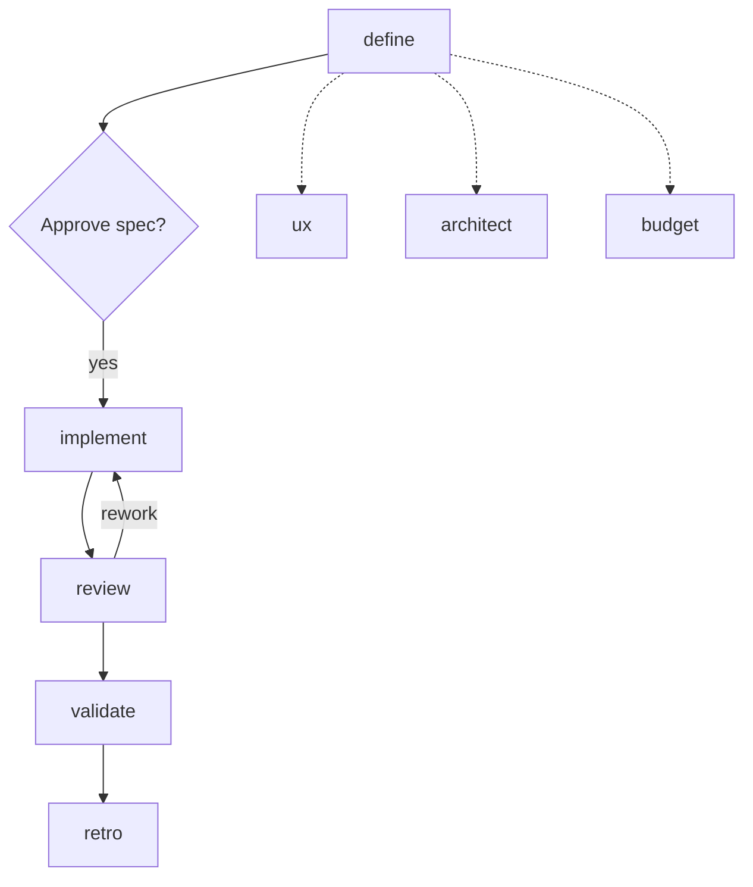
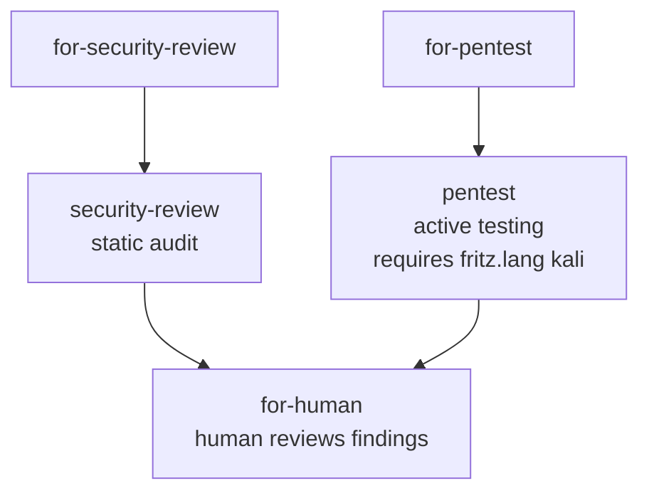

# machina Skills Overview

Quick reference for all machina agent skills, their purposes, and how they work together. For the full system design see the [architecture reference](../../fritz/knowledge/ARCHITECTURE.md); for setup see the [root README](../../README.md).

## Workflow Diagram

The core delivery cycle runs `define` through `validate`, with a human spec gate after `define` and a rework loop from `review` back to `implement`. The daemon autoloop coordinates every transition via GitHub labels.



Security testing runs standalone: both the static audit and the active pentest transition to `for-human` for human judgment on the findings.



## Skills Summary

| Skill | Purpose | Inputs | Outputs |
|-------|---------|--------|---------|
| **define** | Orchestrate spec creation for new features | Problem statement | RICE-scored issue with specs |
| **ux** | Design user experience, JTBD analysis | Problem context | UX_SPEC.md |
| **architect** | Design technical architecture | Requirements, constraints | TECH_SPEC.md |
| **budget** | Estimate effort and resources | Scope from ux/architect | ESTIMATE.md |
| **implement** | Write production code and tests | Issue with specs | PR with code + tests |
| **review** | Code review for quality and correctness | PR from implement | Approval or change requests |
| **validate** | QA testing and UX validation | Approved PR | Pass/fail with test results |
| **security-review** | Security audit of codebase | Issue with scope | Security report with findings |
| **pentest** | Offensive penetration testing (PTES) | Issue with target scope + Kali container | Pentest report with evidence |
| **retro** | Log-driven continuous improvement | Agent logs + project data | Metrics, improvement PRs, retro issue |

## Skill Descriptions

### /define
**Specification Orchestrator** - Coordinates UX, Architect, and Budget pairs to create fully-specified, RICE-scored backlog items. Synthesizes outputs from sub-skills into a unified spec. **Note:** Sub-skills are executed inline (sequentially within the same session), not dispatched to separate containers.

### /ux
**UX Designer Pair** - Creates user experience specifications with JTBD analysis, wireframes, user flows, and competitive differentiation. Focuses on solving problems better than alternatives.

### /architect
**Architecture Pair** - Designs technical specifications including system architecture, API contracts, data models, NFRs, and implementation plans. Balances constraints with requirements.

### /budget
**Estimation Pair** - Estimates effort using T-shirt sizing, applies adjustment factors, and calculates RICE effort scores. Provides risk-adjusted scenarios.

### /implement
**Engineering Pair(s)** - Writes production-quality code following specs. Works as Driver + Navigator pair. Creates PRs with tests and documentation updates.

### /review
**Review Pair** - Reviews PRs for correctness (bugs, edge cases, tests) and quality (patterns, security, performance). Both reviewers must approve.

### /validate
**Validation Pair** - QA testing and UX validation against acceptance criteria. Runs functional tests, checks spec compliance, validates accessibility.

### /security-review
**Security Auditor Pair** - Performs comprehensive security analysis of a codebase. Checks for vulnerabilities (injection, auth, data exposure), dependency CVEs, Docker/CI configuration issues, and secret exposure. Posts a severity-classified report with remediation advice.

### /pentest
**Penetration Testing Pair** - Performs structured offensive security testing following the PTES methodology in a Kali Linux container. Runs active scanning, vulnerability analysis, and exploitation against authorized targets. Requires `fritz.lang:kali` label on the issue. Posts a detailed pentest report with evidence, attack narrative, and remediation advice. Findings transition to `for-human` for human judgment.

### /retro
**Retrospective Agent** - Log-driven continuous improvement system. Scans agent execution archives (from the log archive API) for patterns and failure modes, combines with GitHub project data, and proposes evidence-backed improvements via separate, reviewable PRs (one per change category: skills, knowledge, process). Falls back to GitHub-only analysis when the archive API is unavailable.

## Task Type Routing

| Task Type | Pipeline | Notes |
|-----------|----------|-------|
| New feature | define → implement → review → validate | Full pipeline |
| Enhancement | define → implement → review → validate | May skip budget |
| Bug fix | implement → review → validate | Skip define |
| Chore/docs | implement → review | Skip define + validate |
| Infrastructure | architect → implement → review | Skip ux + budget |
| Security audit | security-review → for-human | Static analysis, standalone |
| Penetration test | pentest → for-human | Active testing, requires Kali (`fritz.lang:kali`) |

## Quick Reference

### Communication Commands
```bash
.fritz/report.sh progress "message"  # Non-terminal update
.fritz/report.sh blocked "message"   # Flag for human help
.fritz/report.sh ask "question" '["A","B"]'  # Get user input
.fritz/report.sh complete "message"  # TERMINAL - container stops
```

### Key Labels
- `fritz.skill:*` - Which skill is working
- `fritz.status:*` - Current phase (active, for-review, validated, etc.)
- `fritz.rework:N` - Rework cycle count (max 3)
- `fritz.repo:owner/name` - Target external repo

### Spec Locations
```text
fritz/specs/{issue}-{slug}/
├── UX_SPEC.md      # From /ux
├── TECH_SPEC.md    # From /architect
└── ESTIMATE.md     # From /budget
```

### Where to write artifacts

Runtime artifacts live under `fritz/` at the repo root: `fritz/specs/`, `fritz/knowledge/`, `fritz/pentest-reports/`. **Do not create new files under `.claude/`.** Claude Code 2.1.78–2.1.125 hard-blocks writes under `.claude/` even with `--dangerously-skip-permissions`; the kali agent image landed in that bug window. Only CC config stays in `.claude/`: `skills/`, `agents/`, `commands/`, `settings.local.json`, plus `orchestrator/` (machina orchestrator config — read-only at runtime, no autonomous writes).

## Change History

- **2026-02-18**: Removed orchestrate skill — daemon autoloop handles all agent dispatching and pipeline transitions (Issue #352)
- **2026-02-07**: Changed define agent to execute sub-skills inline (sequential) instead of dispatching to separate containers. Claude CLI in containers does not have Task tool for parallel dispatch. (Issue #206)
- **2026-02-01**: Added sub-skill failure handling, standardized spec paths, verification before complete, clarified suggestion handling, skip conditions
- **Initial release**: Core skills established
