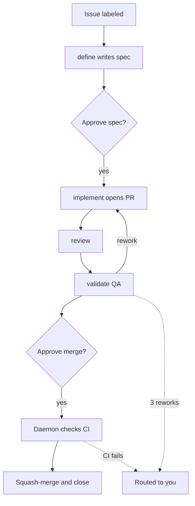
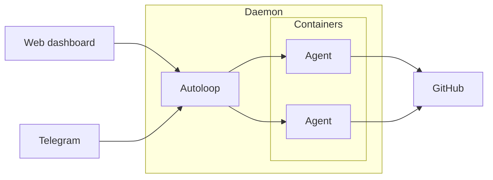

# machina

[](https://github.com/hilsbos/machina/actions/workflows/ci.yml) [](fritz-orchestrator/daemon/TESTING.md) [](fritz-orchestrator/daemon) [](LICENSE)

**A boutique AI software team that lives in your repository.**

> The orchestration daemon and its container images are named `fritz-orchestrator`
> internally (the project's original codename). "machina" is the public project name.

machina turns a GitHub issue into a merged pull request. Ten specialized agent
roles — product, design, architecture, estimation, engineering, code review,
QA, security, penetration testing, and retrospective — pick up work from your
GitHub labels, each in its own Docker container, and carry it from a one-line
idea to shipped code. You direct and watch the whole team from a live web
dashboard and from Telegram. You approve twice per issue, the spec and the
merge. The daemon checks CI and squash-merges the rest.



It is self-hosted and built for a single operator. Point it at one repository
or many, and it works the backlog while you decide the things that need a human.

## The team

Each role is a skill with its own playbook, booted on demand into an isolated
container. Nine are spawned automatically by the pipeline; you call the
retrospective when you want it.

| Role | Department | Delivers |
|------|------------|----------|
| **define** | Product | A specification, RICE-scored, orchestrating the three roles below |
| **ux** | Design | UX spec with jobs-to-be-done, wireframes, and user flows |
| **architect** | Architecture | Technical spec: system design, API contracts, data models, NFRs |
| **budget** | Estimation | Effort estimate with T-shirt sizing and RICE scoring |
| **implement** | Engineering | Production code and tests, opened as a pull request |
| **review** | Code review | Approval or specific, scoped change requests |
| **validate** | QA | Test execution and UX validation, pass or fail with evidence |
| **security-review** | Security | Static security audit with a findings report |
| **pentest** | Offensive security | Active penetration testing in a Kali container, PTES-based |
| **retro** | Operations | Fleet metrics from agent logs, plus improvement pull requests |

The engineering and specification roles work as a Driver and Navigator pair.
The security roles always hand their findings to a human.

## How work flows

machina runs on GitHub labels. A sixty-second loop reads every open issue, boots
the role its `fritz.status:*` label names, and advances the label when the agent
reports back.

1. **Label an issue.** Nothing moves until you promote it into the pipeline.
2. **The team takes it.** define writes the spec, implement opens a PR, review
   checks it, validate runs QA. Rework loops back to engineering automatically,
   up to three times before it escalates to you.
3. **You decide at two gates.** You approve the spec, and you approve the merge.
4. **The daemon merges.** It verifies the PR, checks CI, squash-merges, and
   closes the issue.

Anything that needs judgment — a crash, a failed CI run, a security finding, or
an issue that has reworked too many times — is routed to you rather than forced
through.

> [!IMPORTANT]
> You approve twice per issue: once on the spec, once on the merge. Setting `fritz.auto-pipeline` on an issue removes the two human gates only — CI is still checked before merge.

## Two ways to run it

Both control planes talk to the same daemon, which boots and manages the agent
containers and drives GitHub.



- **Web dashboard.** A live monitoring UI with real-time updates: a Stories
  view and a Flow view of every issue in flight, per-issue history trails,
  retrospective metrics, usage stats, live agent logs, a dependency graph, and
  controls to boot, stop, approve, and toggle the autoloop.
- **Telegram.** Drive the team in natural language from your phone. Boot and
  stop roles, check status, read logs, chat with an agent directly, and tune how
  much the bot tells you with notification modes.

<!-- screenshot: dashboard Stories view and Flow view -->

## Under the hood

- **Isolation.** Every agent runs in its own Docker container with a
  role-specific identity, a mounted workspace, and point-in-time credentials.
- **Language-aware images.** A Node base image plus Java, C/C++, Rust, and Kali
  variants, selected per issue by a `fritz.lang:` label.
- **Guardrails.** A token-bucket rate limiter on every GitHub write, a watchdog
  that recovers issues whose agent died, wall-clock time limits per agent, and an
  automatic pause when your Claude subscription usage gets high.
- **Measures itself.** The retrospective role reads the log archive and proposes
  edits to its own team's playbooks, which you review like any other PR.
- **Tested.** 1,369 tests across 53 files cover the daemon.
- **Multi-repo.** One control plane can work many repositories with a
  `fritz.repo` label.

## Quick start

```bash
cd fritz-orchestrator/daemon
npm install
npm run dev        # runs the daemon directly; use `npm run build && npm start` for production
```

Then in Telegram: `fritz hallo`

You will need Docker, a GitHub token, a Telegram bot, and a Claude Code
subscription. See the [deployment guide](fritz-orchestrator/docs/DEPLOYMENT.md)
for the full setup.

## Documentation

- [Daemon documentation](fritz-orchestrator/README.md) — the orchestrator in depth
- [Quick start](fritz-orchestrator/docs/QUICK-START.md) and [deployment](fritz-orchestrator/docs/DEPLOYMENT.md)
- [HTTP API reference](fritz-orchestrator/docs/API.md)
- [Telegram setup](fritz-orchestrator/docs/TELEGRAM_SETUP.md) and [dashboard](fritz-orchestrator/docs/DASHBOARD.md)
- [CI/CD setup](fritz-orchestrator/docs/CI-CD.md)
- [Security model](fritz-orchestrator/docs/SECURITY.md)
- [Skill playbooks](.claude/skills/) and [knowledge base](fritz/knowledge/)
- [Operations and data lifecycle](fritz/knowledge/OPERATIONS.md)

## Architecture

```text
fritz-orchestrator/   # Node.js orchestration daemon, dashboard, and deployment
.claude/
└── skills/           # The ten role playbooks (define, implement, review, ...)
fritz/
├── knowledge/        # Shared agent memory, synced to every agent at boot
└── specs/            # Feature specifications the team has produced
monitoring/           # Optional Prometheus/Grafana/Loki observability stack
docs/                 # Architecture and evolution docs
```

### Monitoring

An optional observability stack (Prometheus, Grafana, Loki, Alertmanager) lives
in [`monitoring/`](monitoring/README.md) — bring it up with
`cd monitoring && docker compose up -d`.

## Contributing

See [CONTRIBUTING.md](CONTRIBUTING.md) for setup and conventions, and
[SECURITY.md](SECURITY.md) for the security policy and deployment trust boundary.

## License

[MIT](LICENSE) © Patrick Hilsbos

> **Naming note:** "fritZ" is an internal project name. It is unaffiliated with
> AVM GmbH or the "FRITZ!" product family. If you fork this for wider
> distribution, consider choosing a distinct name.
