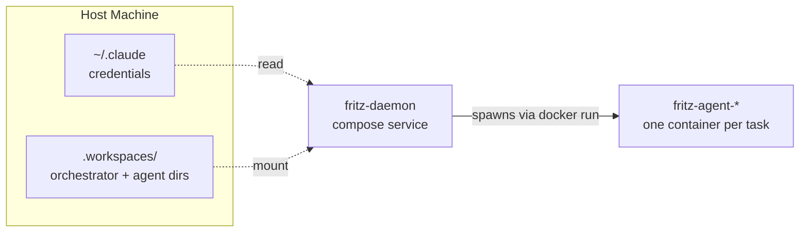
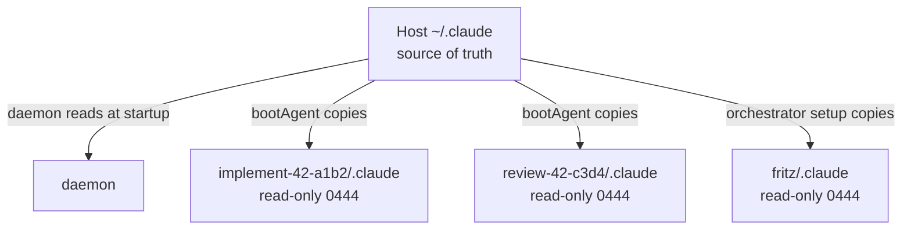

# machina Container Architecture

How the daemon, orchestrator, and agent containers are structured, and how volumes, credentials, and identity are isolated.

Part of the [machina orchestrator](README.md) — see the orchestrator README for setup and usage.

## Architecture



- **Daemon**: Runs as a docker-compose service (production) or native Node.js process (local dev)
- **Orchestrator**: Persistent Claude Code agent, runs inside its own Docker container
- **Agents**: Spawned as **sibling containers** (not children) via the Docker socket

## Volume mounts

### Daemon container (docker-compose.yml)

| Host Path | Container Path | Purpose |
|---|---|---|
| `/var/run/docker.sock` | `/var/run/docker.sock` | Spawn sibling agent containers |
| `.workspaces/` | `/app/.workspaces` | Read/write agent workspace directories |
| `${HOME}/.claude` | `${HOME}/.claude` | Source for credential copying (read by daemon) |

### Orchestrator container (fritz-orchestrator)

| Host Path | Container Path | Purpose |
|---|---|---|
| `.workspaces/fritz/` | `/workspace` | Orchestrator workspace (identity, state) |
| `.workspaces/fritz/.claude/` | `/home/node/.claude` | Isolated `.claude` with copied credentials |

### Agent containers (fritz-agent-{name})

| Host Path | Container Path | Purpose |
|---|---|---|
| `.workspaces/{name}/` | `/workspace` | Agent workspace (identity, assignment, project) |
| `.workspaces/{name}/.claude/` | `/home/node/.claude` | Isolated `.claude` with copied credentials |

## .claude directory isolation

> [!CAUTION]
> The host user's `~/.claude` is never mounted directly into any agent or orchestrator container. Each agent gets its **own** `.claude` directory with credentials copied in read-only.

### Credential flow



Each copied `.claude` contains `.credentials.json` and `subscription_token.json`.

- Credentials are **copied**, not symlinked or bind-mounted
- Copies are set to **read-only (0444)** to prevent agents from modifying them
- Each agent has a completely independent `.claude` with no shared state
- No session pollution between agents (important for `--continue` flag)

### Why not share ~/.claude?

Previously all agents shared `~/.claude`, which caused:

1. **Session state pollution** — the orchestrator's `--continue` flag would pick up agent session history
2. **Identity confusion** — Claude Code stores per-session state in `~/.claude`
3. **Race conditions** — multiple agents writing to the same directory simultaneously

Fixed in commit `f8998ef`.

## Identity system

Identity is managed through `.fritz/`, completely separate from `.claude/`. The `.claude` directory is only for Claude Code internals (credentials, session state). Agent identity is handled by the machina boot system.

### Per-agent workspace layout

```text
.workspaces/{name}/
├── CLAUDE.md                  # Auto-loaded by Claude Code; points to .fritz/
├── .claude/                   # Isolated Claude Code internals
│   ├── .credentials.json      #   Auth credentials (read-only copy)
│   └── subscription_token.json
├── .fritz/                    # machina agent identity and state
│   ├── identity.md            #   Role definition (from SKILL.md template)
│   ├── assignment.md          #   Task details (from GitHub issue)
│   ├── knowledge/             #   Shared team knowledge base (copied)
│   ├── report.sh              #   Post updates to GitHub
│   └── state.json             #   Agent lifecycle state
└── project/                   # Cloned target repository
```

### Identity loading sequence

1. Claude Code starts in `/workspace` and auto-loads `CLAUDE.md`
2. `CLAUDE.md` instructs: "Read `.fritz/identity.md`"
3. Agent reads identity (role, values, working guidelines)
4. Agent reads `.fritz/assignment.md` (GitHub issue details, step-by-step instructions)
5. Agent checks `.fritz/knowledge/` for shared patterns and decisions

### Agent naming and uniqueness

Each agent gets a unique name with a timestamp suffix for uniqueness:

- **Issue agents:** `{role}-{issue}-{suffix}` (e.g., `implement-42-a1b2`, `review-42-c3d4`)
- **Manual agents:** `{role}-{suffix}` (e.g., `architect-e5f6`)

The suffix is the last 4 hex characters of the current timestamp, ensuring unique names across rework cycles and manual retries of the same issue.

This name determines:

- Workspace directory: `.workspaces/{name}/`
- Container name: `fritz-agent-{name}`
- Isolated `.claude` path: `.workspaces/{name}/.claude/`

Docker prevents duplicate container names, so two agents with the same name cannot run simultaneously. Additionally, `agents.ts` checks GitHub for active agents on the same issue before spawning.

## Docker-in-Docker path mapping

When the daemon runs inside Docker (production), it spawns agent containers as **siblings** on the host Docker. This creates a path translation problem:

| Context | Path |
|---|---|
| Daemon sees | `/app/.workspaces/implement-42-a1b2/` |
| Host has | `/opt/fritz/.workspaces/implement-42-a1b2/` |
| Agent needs | Host path in `-v` flag |

> [!IMPORTANT]
> Because agents are siblings on the host Docker, their `-v` mounts need host paths, not the daemon's container paths. `HOST_WORKSPACES_DIR` and `HOST_CLAUDE_HOME` supply those host paths; in local dev they are unset because the daemon's paths are already host paths.

| Variable | Purpose | Example |
|---|---|---|
| `HOST_WORKSPACES_DIR` | Host path to `.workspaces/` | `/opt/fritz/.workspaces` |
| `HOST_CLAUDE_HOME` | Host path to `~/.claude/` | `/home/fritz/.claude` |

### Path resolution in agents.ts

```ts
if (config.hostWorkspacesDir) {
    // Production: translate container path → host path
    hostWorkspacePath = `${config.hostWorkspacesDir}/${agentName}`
    hostAgentClaudePath = `${config.hostWorkspacesDir}/${agentName}/.claude`
} else {
    // Local dev: paths are already host paths
    hostWorkspacePath = workspace
    hostAgentClaudePath = join(workspace, '.claude')
}
```

### HOST_CLAUDE_HOME

The daemon uses this priority chain to find the credential source:

1. `HOST_CLAUDE_HOME` (explicit override from .env)
2. `CLAUDE_HOME` (alternative override)
3. `${HOME}/.claude` (automatic default)

You typically don't need to set this — the default `${HOME}/.claude` works because docker-compose expands `${HOME}` to your host user's home directory before starting the container.

Only set it if:

- You see "Claude home not found" warnings in logs
- The `.claude` directory is in a non-standard location
- You're using a custom deployment user with different paths

## Setup

### Prerequisites

1. Docker installed and running
2. `.env` file with required variables:
   ```bash
   ANTHROPIC_API_KEY=sk-ant-...
   TELEGRAM_BOT_TOKEN=...
   TELEGRAM_CHAT_ID=...
   GH_TOKEN=... (optional)
   GITHUB_REPO=username/repo (optional)

   # Optional — only needed if the default doesn't work:
   # HOST_CLAUDE_HOME=${HOME}/.claude
   ```

### Building the agent image

```bash
cd fritz-orchestrator

# Base agent (Node.js + Claude Code + GitHub CLI)
docker build -t fritz-agent -f Dockerfile.agent .

# Language variants (extend base)
docker build -t fritz-agent-java -f Dockerfile.agent.java .
docker build -t fritz-agent-cpp -f Dockerfile.agent.cpp .
docker build -t fritz-agent-rust -f Dockerfile.agent.rust .
```

### Local development

```bash
# From fritz-orchestrator directory
npm start
```

This runs the daemon as a native Node.js process and spawns agents as Docker containers via the Docker socket.

### Production (Docker Compose)

```bash
cd fritz-orchestrator

# Development (builds images locally)
docker-compose build
docker-compose up -d

# Production (pre-built images)
docker-compose -f docker-compose.prod.yml up -d

# Logs
docker-compose logs -f

# Stop
docker-compose down
```

### Runtime detection

The code automatically detects if it's running inside Docker:

- Checks for `/.dockerenv` file
- Checks `/proc/1/cgroup` for docker/containerd

Override with environment variable:

```bash
FRITZ_RUNTIME_MODE=docker  # Force Docker mode
FRITZ_RUNTIME_MODE=native  # Force native mode
```

## Troubleshooting

### Agents not starting

1. Check Docker is running: `docker ps`
2. Verify agent image exists: `docker images | grep fritz-agent`
3. Check logs: `docker logs fritz-agent-{name}`

### Permission issues

Ensure Docker socket is accessible:

```bash
ls -l /var/run/docker.sock
```

### Build failures

Dockerfile paths are relative to `fritz-orchestrator/`:

- `daemon/package*.json`
- `daemon/src`
- `Dockerfile.agent`
- `entrypoint.sh`

### Claude subscription auth not working

1. Check daemon logs for mount paths:
   ```bash
   docker-compose logs fritz-daemon | grep "Mounting\|Copied\|credential"
   ```

2. Verify credentials were copied into agent workspace:
   ```bash
   ls -la .workspaces/{agent-name}/.claude/
   ```

3. Check permissions (credential copies should be 0444):
   ```bash
   stat .workspaces/{agent-name}/.claude/.credentials.json
   ```

4. Verify `HOST_CLAUDE_HOME` resolves correctly:
   ```bash
   docker exec fritz-daemon env | grep CLAUDE_HOME
   ```

## Dashboard browser requirements

The dashboard uses **Server-Sent Events (SSE)** for real-time updates.

- Modern browser with `EventSource` and `AbortController` support (Chrome 66+, Firefox 57+, Safari 12.1+)
- The dashboard auto-reconnects on SSE disconnect with exponential backoff (2s → 4s → 8s → 16s → 30s cap). A "Reconnecting" indicator appears in the status bar during reconnection

> [!IMPORTANT]
> The network path must allow long-lived HTTP connections. If the dashboard is behind a reverse proxy, it must not buffer or time out SSE streams. For nginx, set `proxy_buffering off` and `proxy_read_timeout 86400s`.

<!-- screenshot: dashboard status bar showing the Reconnecting indicator -->

### Troubleshooting a frozen dashboard

If the dashboard appears frozen (stale data, no updates):

1. Check the SSE connection: **DevTools → Network → filter "EventStream"**. If no active connection, the dashboard should show "Reconnecting" and auto-recover
2. Check the daemon process: `docker logs fritz-daemon --tail 50`
3. If the status bar shows "Disconnected" for >60s, hard-refresh the page (`Ctrl+Shift+R`)

## Source references

| File | What it does |
|---|---|
| `daemon/src/api/api.ts` | HTTP API for agent notifications; stops container on completion |
| `daemon/src/agents/boot.ts` | Creates workspace, copies credentials, writes identity/assignment |
| `daemon/src/agents/agents.ts` | Builds Docker run command with volume mounts, container lifecycle |
| `daemon/src/orchestrator/orchestrator.ts` | Creates orchestrator workspace and container |
| `daemon/src/config.ts` | Resolves `claudeHome`, `hostWorkspacesDir`, `hostClaudeHome` |
| `daemon/src/runtime.ts` | Docker detection logic |
| `docker-compose.yml` | Daemon service definition (dev) |
| `docker-compose.prod.yml` | Daemon service definition (production) |
