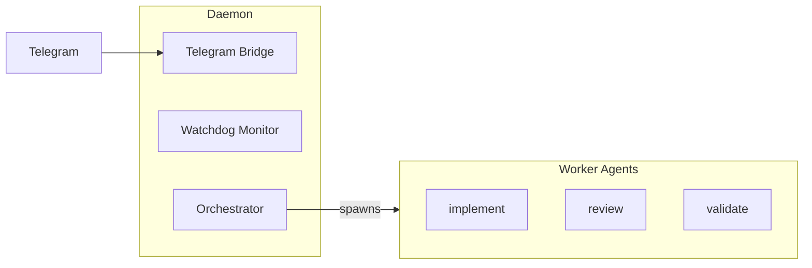
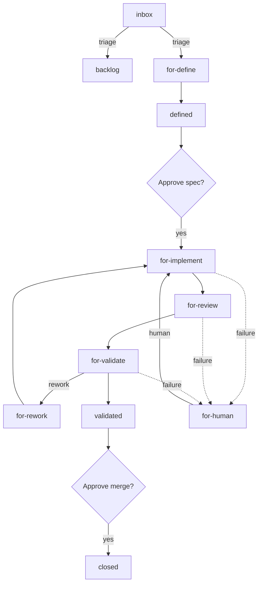
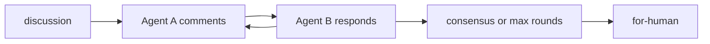

# machina Orchestrator

[](https://github.com/hilsbos/machina/actions/workflows/ci.yml) [](daemon/TESTING.md) [](daemon) [](../LICENSE)

Control Claude Code agents from Telegram. Spawn agents, chat with Claude, manage GitHub issues - all from your phone.

Part of the [machina monorepo](../README.md) — see the root README for the overall project.

## Contents

- [Architecture](#architecture)
- [Quick start](#quick-start)
- [Telegram commands](#telegram-commands)
- [Agent roles](#agent-roles)
- [GitHub integration](#github-integration)
- [Configuration](#configuration)
- [Directory structure](#directory-structure)
- [How it works](#how-it-works)
- [Monitoring](#monitoring)
- [Troubleshooting](#troubleshooting)
- [Production deployment](#production-deployment)
- [Deployment tracker](#deployment-tracker)
- [Testing](#testing)
- [Development](#development)
- [License](#license)

## Architecture



### Orchestrator (the brain)

This is machina itself:

- Watches GitHub for actionable issues
- Watches Telegram for commands
- Does smart triage (analyzes issues, adds labels)
- Spawns worker agents
- Tracks status through the whole lifecycle

```bash
npm start
```

### Worker agents (the hands)

Spawned by the orchestrator to do specific work:

- Implement, review, validate, define, architect, etc.
- Work on assigned issues
- Report progress and completion via daemon HTTP API (`/api/notify`)
- On completion, daemon stops the container and transitions the issue to the next status
- Don't watch or orchestrate - just execute

### Human (the owner)

Can intervene anywhere in the flow:

- Move issues between statuses
- Add/remove labels
- Approve and merge
- Override agent decisions

## Quick start

### Prerequisites

```bash
# Node.js 18+
node --version

# GitHub CLI (authenticated)
gh auth status

# Claude Code CLI
claude --version
```

### Setup

```bash
cd fritz-orchestrator/daemon

# Install dependencies
npm install

# Authenticate with Claude Code (one-time setup)
claude setup-token

# Create .env
cat > .env << 'EOF'
# Authentication: Automatic via ~/.claude directory
# Only needed if Claude Code CLI is not authenticated:
# ANTHROPIC_API_KEY=sk-ant-api03-...

TELEGRAM_BOT_TOKEN=123456:ABC...
TELEGRAM_CHAT_ID=-100...
GH_TOKEN=ghp_...
GITHUB_REPO=owner/repo
EOF
```

### Run

> [!TIP]
> `npm run dev` runs the daemon directly from TypeScript — no build step needed.

```bash
# Development (runs TypeScript directly, no build needed)
npm run dev

# Or for production-like setup:
npm run build && npm start
```

## Telegram commands

```text
fritz <anything>      - Talk to Claude Code directly
fritz status          - Show running agents
fritz boot impl 42    - Start implement agent for issue #42
fritz boot impl 42 -chat  - Start agent in chat mode (waits for instructions)
fritz stop <name>     - Stop an agent
fritz logs <name>     - View agent logs
fritz diagnose        - System freshness check (skills, knowledge, config vs GitHub)
fritz auto-pipeline #N  - Enable auto-pipeline for issue (skip human gates)
fritz auto-pipeline off #N - Disable auto-pipeline for issue
fritz mode             - Show current notification mode
fritz mode <mode>      - Set notification mode (essential|quiet|compact|verbose)
/cleanup [hours]      - Remove old workspaces (default: 24h)
/diagnose [verbose]   - Detailed system diagnosis
```

Examples:

```text
fritz erstelle ein issue für dark mode
fritz was sind die offenen issues?
fritz lies die README
fritz boot implement für issue 42
fritz boot implement 42 -chat   # Interactive chat mode
```

### Chat mode

By default, agents auto-execute their CLAUDE.md instructions immediately upon boot. Use `-chat` to start agents in interactive chat mode instead:

```text
fritz boot implement 42 -chat
fritz boot review -chat
fritz boot -chat implement 42   # Flag can be placed anywhere
```

In chat mode:

- Agent receives a modified assignment that says "wait for user instructions"
- Agent does NOT auto-execute tasks
- Telegram shows "💬 Chat mode — waiting for your instructions"
- You send the first message via `/tell` or by replying to the agent's message

### Chat mode feedback

When sending messages to chat-mode agents, machina provides real-time feedback.

**Immediate acknowledgment:**

- `📨 Received! Processing...` — Message received, agent is working
- `📋 Queued (#N in line)` — Agent is busy, your message is queued

**During processing:**

- Telegram typing indicator appears while agent is working
- Periodic progress updates show elapsed time (every 30s)
- Timeout warning at 80% of timeout limit

**Configuration (optional):** These settings are configured in `fritz.yaml` under the `telegram:` section:

```yaml
telegram:
  chatFeedbackEnabled: true          # Enable/disable feedback (default: true)
  typingIndicatorIntervalMs: 4000    # ms between typing indicators (default: 4s)
  progressUpdateIntervalMs: 30000    # ms between progress updates (default: 30s)
  timeoutWarningThreshold: 0.8       # Warn at 80% of timeout (default: 0.8)
```

**Troubleshooting timeouts:**

- If you see timeout warnings, the agent may be working on a complex task
- Consider breaking down large requests into smaller steps
- Use `/logs <agent-name>` to see what the agent is currently doing

### Notification modes

Control the verbosity of Telegram lifecycle notifications (agent start, progress, completion):

| Mode | Behavior |
|------|----------|
| `essential` | Only questions, problems, and direct replies (blocked, failed, agent_response) |
| `quiet` | Only warnings and errors (blocked, failed, timeout) |
| `compact` | One message per agent, updated in-place via message edits |
| `verbose` | Every event gets a new message |

**Configuration:** Set in `fritz.yaml` or toggle at runtime:

```yaml
telegram:
  notificationMode: essential  # essential | quiet | compact | verbose
```

```text
fritz mode              # Show current mode
fritz mode essential    # Switch to essential
fritz mode quiet        # Switch to quiet
fritz mode compact      # Switch to compact
fritz mode verbose      # Switch to verbose
```

> [!NOTE]
> Notification modes control agent lifecycle notifications (start, progress, completion). Chat feedback (typing indicators, processing updates) is controlled separately via `telegram.chatFeedbackEnabled`.

## Agent roles

| Role | Description | Default TTL (base) |
|------|-------------|--------------------|
| `implement` | Write code, create PRs | 25m |
| `review` | Code review | 15m |
| `validate` | QA testing | 15m |
| `architect` | System design | 1h |
| `define` | Requirements, RICE scoring | 20m |
| `ux` | Wireframes, user journeys | 30m (default) |
| `budget` | Effort estimation | 30m (default) |
| `retro` | Retrospectives | 30m (default) |

> [!NOTE]
> TTL is wall-clock from agent start: the watchdog expires an agent when `now > started + ttl`. It does NOT reset on communication or activity. A TTL of `0` means long-running (never expires via TTL).

The figures above are base values from `config/fritz.yaml` (see `daemon/src/core/registry.ts` `getExpiredAgents()`). Roles without an override inherit `defaults.ttl` (30m), and the effective TTL is `base × teams.ttlMultiplier` (default `2.0`). Separately, the watchdog also cleans up dead/stale agents and old workspaces — that activity-based cleanup is distinct from TTL expiry.

## GitHub integration

### Status labels

Issues are tracked with status labels using the `for-{role}` pattern that shows where work is in the pipeline:

| Label | Description | Set By |
|-------|-------------|--------|
| `fritz.status:inbox` | New issue, needs triage | Manual |
| `fritz.status:backlog` | Deprioritized | Manual |
| `fritz.status:for-define` | Waiting for define agent | Manual or previous agent |
| `fritz.status:defined` | Spec complete, awaiting human review | Define agent |
| `fritz.status:for-implement` | Waiting for implement agent | Human (after reviewing spec) |
| `fritz.status:for-architect` | Waiting for architect agent | Define agent |
| `fritz.status:for-ux` | Waiting for UX agent | Define agent |
| `fritz.status:for-budget` | Waiting for budget agent | Define agent |
| `fritz.status:for-review` | Waiting for review agent | Implement agent |
| `fritz.status:for-validate` | Waiting for validate agent | Review agent |
| `fritz.status:for-rework` | Review/validate rejected, needs fixes; or branch needs rebase | Review/validate/merge agent |
| `fritz.status:for-human` | Human must look (failure/issue) | Agent failure |
| `fritz.status:active` | Agent is working | Agent start |
| `fritz.status:discussion` | Multi-agent discussion in progress | Manual |
| `fritz.status:validated` | All checks passed, ready for human merge | Validate agent |

### Workflow



> [!IMPORTANT]
> machina has two human approval gates: a human reviews the spec before implementation (`defined` → `for-implement`), and a human merges the PR after validation (`validated` → closed). Everything between those gates runs automatically.

**Auto-orchestration sequence:**

1. **New issue** lands in `inbox`
2. **Human triages** → moves to `backlog` or `for-define`
3. **Auto-loop** detects `for-define` → spawns define agent
4. **Define agent** calls `report.sh complete` → daemon stops container → `defined`
5. **Human reviews spec** → challenges if needed, iterates → manually sets `for-implement`
6. **Auto-loop** spawns implement agent → `for-review`
7. **Auto-loop** spawns review agent → `for-validate`
8. **Auto-loop** spawns validate agent → `validated`
9. **Human merges PR** → issue closes automatically

If any agent fails → `for-human` → human investigates.
If an agent never reports completion, the watchdog catches it after TTL expiry (wall-clock, measured from agent start) → `for-human`.

**Rework loop:** When `review` or `validate` rejects work → `for-rework` → implement agent is re-spawned. Rework cycles are tracked via `fritz.rework:N` labels (max 3 before escalation to human).

**Direct routing:** Each `for-{role}` status directly spawns the corresponding agent:

- `for-define` → define agent
- `for-implement` → implement agent
- `for-review` → review agent
- `for-validate` → validate agent
- `for-rework` → implement agent (for fixes)

### Auto-pipeline

The `fritz.auto-pipeline` label enables automatic transitions that normally require human intervention:

> [!IMPORTANT]
> `fritz.auto-pipeline` removes the two human gates only. CI is still checked before merge.

| Status | Default (manual) | With `fritz.auto-pipeline` |
|--------|-----------------|---------------------------|
| `defined` | Human reviews spec, sets `for-implement` | Auto-transitions to `for-implement` |
| `validated` | Human merges PR, closes issue | Auto-merges PR (squash) and closes issue |

All other transitions (implement → review → validate, rework loops) remain unchanged.

```bash
# Enable auto-pipeline
fritz auto-pipeline #123          # Single issue
fritz auto-pipeline #123 #124     # Multiple issues

# Disable auto-pipeline
fritz auto-pipeline off #123
```

### Depends-on

Issues can declare dependencies using `fritz.depends-on:NNN` labels. The auto-loop checks dependencies before spawning agents:

- `fritz.depends-on:123` → Agent won't spawn until issue #123 is closed
- Multiple dependencies are supported (all must be closed)
- Labels are created manually on GitHub issues (no pre-configuration needed)

### Auto-pipeline failure behavior

When auto-pipeline transitions fail, the daemon handles errors gracefully:

| Failure | Behavior |
|---------|----------|
| **No open PR found** (`validated`) | Issue stays as `validated`, Telegram notification sent |
| **Merge conflict / branch protection** (`validated`) | Issue stays as `validated`, Telegram notification sent with error details |
| **Label swap fails** (`defined` → `for-implement`) | Rolls back to `defined` status, Telegram notification sent |
| **Dependency check fails** | Dependency treated as not closed (safe default), warning logged |

All auto-pipeline failures are surfaced to Telegram so humans are notified and can intervene.

### Role labels

Issues get skill labels showing which agent type is currently working on them:

- `fritz.skill:implement`, `fritz.skill:review`, `fritz.skill:validate`, etc.

These labels are removed when the agent finishes, keeping the kanban board clean. The activity log (issue comments plus the daemon event log) preserves the full history of which agents worked on the issue.

### Discussion mode

For multi-agent collaboration (e.g., architect + UX debating a design):

1. Add multiple skill labels to an issue: `fritz.skill:architect` + `fritz.skill:ux`
2. Move to `fritz.status:discussion`
3. Agents take turns commenting (max 3 rounds each)
4. Discussion ends → `for-human` for human review



### Multi-repo support

machina can manage agents working on external repositories while keeping all issue tracking centralized in the machina hub repo.

**Label syntax:**

- `fritz.repo:owner/name` — Clone external repo, use default branch
- `fritz.repo:owner/name:branch` — Clone repo and checkout specific branch

**Example:**

```bash
# Create issue for client work (uses default branch)
gh issue create --repo hilsbos/machina \
  --title "Add OAuth to client-app" \
  --label "fritz.status:for-implement,fritz.repo:client/client-app"

# Target a specific branch
gh issue create --repo hilsbos/machina \
  --title "Fix bug on release branch" \
  --label "fritz.status:for-implement,fritz.repo:client/client-app:release/2.0"
```

**How it works:**

1. Daemon detects `fritz.repo:` label on the issue
2. Agent clones the external repo (not machina)
3. If branch specified, agent checks out that branch
4. Agent creates feature branch from the target branch
5. PR is created targeting the specified branch (not main)
6. All status tracking stays in the machina issue

**Use case:** Managing work across multiple client projects from a single machina hub.

### Activity log

Every agent action on an issue is recorded as an issue comment — posted by the agent's `report.sh` through the daemon's `/api/notify` endpoint — and in the daemon's local event log. Together they form a complete audit trail of which agents worked on each issue and when.

## Configuration

### Environment variables

| Variable | Required | Description |
|----------|----------|-------------|
| `ANTHROPIC_API_KEY` | No* | Claude API key (for production/headless) |
| `TELEGRAM_BOT_TOKEN` | Yes | From @BotFather |
| `TELEGRAM_CHAT_ID` | Yes | Your chat/group ID |
| `GH_TOKEN` | Yes | GitHub token with repo access |
| `GITHUB_REPO` | No | Default repo (owner/repo) |
| `HOST_CLAUDE_HOME` | No** | Docker: Path to .claude directory (default: `${HOME}/.claude`) |
| `config/fritz.yaml` | N/A | Agent TTLs per role, daemon limits, Telegram UX tuning, agent behavior flags (see `fritz.yaml` for all options) |

\* Not required for local development if you have Claude Code authenticated
\*\* Optional for Docker deployments - default works for most users. Only set if you see "Claude home not found" errors

### Authentication

**Recommended: Claude Code (local & production)**

- Install Claude Code on the machine (Mac/Linux)
- Run once: `claude setup-token`
- Agents use the authenticated CLI session
- Subscription billing (fixed monthly cost)
- No environment variables needed
- Works identically on local dev and production servers

**Fallback: API key (CI/CD or truly headless)**

- Only use if Claude Code installation is not possible
- Get from https://console.anthropic.com/
- Set `ANTHROPIC_API_KEY=sk-ant-api03-...` in `.env`
- Pay-per-token billing (more expensive at scale)

### Telegram topics (optional)

For forum-style groups with topics, configure topic thread IDs in `config/fritz.yaml`:

```yaml
telegram:
  topics:
    define: 123       # Design/planning (define, ux, architect, budget)
    implement: 456     # Implementation progress
    review: 789        # Code review updates
    validate: 101      # Testing/validation results
    questions: 102     # Questions, blocks, errors, timeouts
    retro: 103         # Team retrospectives
```

## Directory structure

<details>
<summary>Full directory layout</summary>

```text
fritz-orchestrator/
├── daemon/                     # Node.js daemon
│   ├── src/
│   │   ├── index.ts            # Entry point
│   │   ├── config.ts           # Configuration loading
│   │   ├── runtime.ts          # Docker detection logic
│   │   ├── types.ts            # TypeScript types
│   │   │
│   │   ├── core/               # Core system components
│   │   │   ├── registry.ts     # Agent state tracking
│   │   │   ├── watchdog.ts     # Health monitoring
│   │   │   ├── lifecycle.ts    # Agent lifecycle notifications
│   │   │   └── diagnose.ts     # System freshness diagnosis
│   │   │
│   │   ├── agents/             # Agent management
│   │   │   ├── agents.ts       # Docker container management
│   │   │   ├── boot.ts         # Workspace setup, credential copying
│   │   │   ├── agent-comms.ts  # Bidirectional agent messaging
│   │   │   ├── autoloop.ts     # Auto-orchestration loop
│   │   │   ├── session-parser.ts # Session output parsing
│   │   │   └── focus.ts        # Agent focus state
│   │   │
│   │   ├── telegram/           # Telegram integration
│   │   │   ├── telegram.ts     # Main bot logic
│   │   │   ├── telegram-buttons.ts # Inline keyboard buttons
│   │   │   ├── telegram-helpers.ts # Formatting utilities
│   │   │   ├── message-formatter.ts # Message formatting
│   │   │   └── message-tracker.ts   # Message tracking
│   │   │
│   │   ├── github/             # GitHub integration
│   │   │   └── github.ts       # GitHub API operations
│   │   │
│   │   ├── api/                # HTTP API
│   │   │   └── api.ts          # Server for agent notifications
│   │   │
│   │   └── orchestrator/       # Claude Code orchestrator
│   │       └── orchestrator.ts # Persistent Claude Code process
│   │
│   ├── package.json
│   └── tsconfig.json
│
├── docs/                       # Documentation
├── docker-compose.yml          # Dev: daemon service definition
├── docker-compose.prod.yml     # Production: pre-built images from GHCR
├── Dockerfile                  # Daemon container image
├── Dockerfile.agent            # Agent container image
├── DOCKER.md                   # Container architecture docs
└── README.md                   # This file
```

</details>

## How it works

1. Daemon starts, launches HTTP API server and Telegram bot
2. Spawns Claude Code orchestrator process
3. Telegram messages go to daemon → orchestrator via CLI → response back to Telegram
4. Agents report status via HTTP API (POST /api/notify)
5. On type=complete: daemon notifies Telegram + GitHub, stops container, transitions labels
6. Watchdog monitors for stale agents that never report completion (TTL backstop, wall-clock from agent start)
7. Watchdog automatically cleans up old workspace directories (configurable via `fritz.yaml → daemon.workspaceMaxAgeHours`)

Orchestrator workspace:

```text
.workspaces/fritz/
├── .fritz/
│   └── identity.md    # Orchestrator instructions
└── .claude/           # Isolated credentials (copied, not shared)
```

## Monitoring

### Check status

```bash
# From Telegram
fritz status

# From terminal (Docker)
docker ps --filter "name=fritz-"
```

### View logs

```bash
# Agent logs
fritz logs <agent-name>

# Daemon logs (Docker)
docker compose logs -f

# Specific agent container
docker logs fritz-agent-<name>

# Local dev
npm start  # (logs to stdout)
```

## Troubleshooting

### Daemon won't start

```bash
# Check config
cat .env

# Check Telegram bot token
curl https://api.telegram.org/bot<TOKEN>/getMe
```

### Agents not responding

```bash
# Check running containers
docker ps --filter "name=fritz-"

# Check daemon logs
docker compose logs fritz-daemon
```

### Orchestrator timeout

The orchestrator needs ~60-90s to start. If it times out:

```bash
# Check process logs
fritz logs orchestrator

# Restart
npm start
```

## Production deployment

Production uses Docker containers deployed via GitHub Actions. No manual `git clone` or `npm install` on the server.

### How it works

1. Push a version tag (`v*`) or trigger manually
2. `build-daemon.yml` and `build-agent-images.yml` build and push Docker images to GHCR
3. `deploy.yml` SSHs into the server, pulls images, runs `docker compose up -d`

### Quick summary

```bash
# One-time server setup:
# 1. Create fritz service user
# 2. Install Docker + Claude Code
# 3. Create /opt/fritz/.env with secrets
# 4. Configure GitHub Secrets (SSH_HOST, SSH_USER, SSH_PRIVATE_KEY)

# Deploy:
git tag v1.0.0 && git push origin v1.0.0
# Then trigger deploy.yml from GitHub Actions

# Verify:
ssh fritz@<server> 'cd /opt/fritz && docker compose ps'
```

See the [deployment guide](docs/DEPLOYMENT.md) for the full server provisioning guide.

### Monitoring (production)

```bash
# Container status
docker ps --filter "name=fritz-"

# Daemon logs
docker compose -f /opt/fritz/docker-compose.yml logs -f

# Specific agent logs
docker logs fritz-agent-<name>

# Restart
cd /opt/fritz && docker compose restart
```

### Local development with PM2

For local development, PM2 can manage the daemon process:

```bash
npm run pm2:start     # Start with PM2
npm run pm2:logs      # View logs
npm run pm2:status    # Check status
npm run pm2:restart   # Restart
npm run pm2:stop      # Stop
```

## Deployment tracker

After machina auto-merges a PR, the **deployment tracker** creates or updates a GitHub issue per repo listing all undeployed changes as a checklist.

### How it works

- Issue title: `Deployment pending — <repo>`, label: `deployment-pending`, assigned to `@hilsbos`
- Each merged PR adds a checklist entry; hotfix PRs add a `priority:p0` label + urgent banner
- Rollback PRs (title starts with "Revert" or label `revert`) are prefixed with `⚠️ ROLLBACK:`
- **Closing the issue = deployed** — machina does not auto-close it
- Stale reminder fires after configurable days (default: 3) via Telegram at critical level

### Configuration

```yaml
# fritz.yaml
daemon:
  staleDeploymentReminderDays: 3  # Days before stale reminder (default: 3)

repos:
  hilsbos/some-repo:
    deployment-tracker: false     # Opt out for this repo
```

See the [deployment operator guide](../.claude/orchestrator/knowledge/DEPLOYMENT.md) for the full operator guide.

## Testing

```bash
cd daemon

# Run all tests
npm test

# Watch mode
npm run test:watch

# With coverage report
npm run test:coverage
```

The test suite uses [Vitest](https://vitest.dev/) with 1,369 tests across 53 files. See [daemon/TESTING.md](daemon/TESTING.md) for architecture and patterns.

## Development

```bash
# Watch mode (auto-restart)
npm run watch

# Type check
npx tsc --noEmit

# Run directly with tsx
npx tsx src/index.ts
```

## License

machina is released under the [MIT License](../LICENSE). © Patrick Hilsbos. See the [root README](../README.md) for the overall project.
