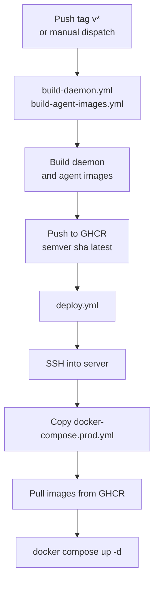

# machina CI/CD Pipeline

How machina is built and deployed with GitHub Actions. For server provisioning, see the [deployment guide](DEPLOYMENT.md); for the full picture, see the [machina orchestrator README](../README.md).

## Pipeline overview

Three GitHub Actions workflows handle building and deploying machina:



## build-daemon.yml + build-agent-images.yml

**Triggers:**

- Push tags matching `v*`
- Manual dispatch (`workflow_dispatch`)

**What they do:**

1. Checks out the repository
2. Sets up Docker Buildx
3. Logs into GitHub Container Registry (ghcr.io)
4. `build-daemon.yml` builds `fritz-daemon` image from `fritz-orchestrator/Dockerfile`
5. `build-agent-images.yml` builds `fritz-agent` image from `fritz-orchestrator/Dockerfile.agent`
6. Pushes to `ghcr.io/your-org/fritz-daemon` and `ghcr.io/your-org/fritz-agent`
7. Tags with semver (from git tag), git SHA, and `latest` (on default branch)

**Images:**

- `ghcr.io/your-org/fritz-daemon` — the daemon that manages agents and Telegram
- `ghcr.io/your-org/fritz-agent` — the base image for spawned Claude Code agents

## deploy.yml

**Triggers:**

- Manual dispatch (`workflow_dispatch` with optional `environment` and `image_tag` inputs)
- Release published

**What it does:**

1. SSHs into the production server as `$SSH_USER`
2. Copies `docker-compose.prod.yml` to `/opt/fritz/docker-compose.yml`
3. Copies `.env.example` to `/opt/fritz/.env.example`
4. Checks that `/opt/fritz/.env` exists (must be created manually once — see the [deployment guide](DEPLOYMENT.md))
5. Logs into GHCR on the remote server
6. Pulls both images with the specified tag (default: `latest`)
7. Tags pulled images as `fritz-daemon:latest` and `fritz-agent:latest`
8. Runs `docker compose up -d`
9. Verifies containers are running
10. Cleans up old Docker images

## How to deploy

### Standard release

```bash
# 1. Create a release tag
git tag v1.2.3 && git push origin v1.2.3

# 2. build-daemon.yml + build-agent-images.yml trigger automatically on the tag push

# 3. Trigger deploy.yml manually from the Actions tab
#    Or: create a GitHub Release (publish triggers deploy automatically)
```

### Manual deploy (specific tag)

1. Go to Actions > deploy.yml > Run workflow
2. Set `image_tag` to the desired version (e.g., `v1.2.3` or `sha-abc1234`)
3. Click "Run workflow"

### Redeploy current version

1. Go to Actions > deploy.yml > Run workflow
2. Leave `image_tag` as default (`latest`)
3. Click "Run workflow"

## GitHub secrets required

| Secret | Purpose |
|--------|---------|
| `SSH_HOST` | Production server IP address |
| `SSH_USER` | SSH user on the server (e.g., `fritz`) |
| `SSH_PRIVATE_KEY` | Private key for SSH authentication |

`GITHUB_TOKEN` is provided automatically by GitHub Actions.

## Other active workflows

| Workflow | Purpose |
|----------|---------|
| `claude.yml` | Agent automation workflows |
| `claude-code-review.yml` | Automated code reviews on PRs |

## Monitoring deployments

### From GitHub

- Check the Actions tab for workflow run status and logs
- Each deploy run shows container status in its summary

### From the server

```bash
# SSH into server
ssh fritz@<server>

# Check container status
cd /opt/fritz && docker compose ps

# View logs
docker compose logs -f

# Check all machina containers (including agents)
docker ps --filter "name=fritz-"
```

## Rollback

To roll back to a previous version:

1. Go to Actions > deploy.yml > Run workflow
2. Set `image_tag` to the previous version tag (e.g., `v1.1.0`)
3. Click "Run workflow"

The deploy workflow will pull the older images and restart containers.

## Architecture reference

- See the [Docker architecture guide](../DOCKER.md) for container architecture, volume mounts, and credential isolation
- See the [deployment guide](DEPLOYMENT.md) for server provisioning and setup
