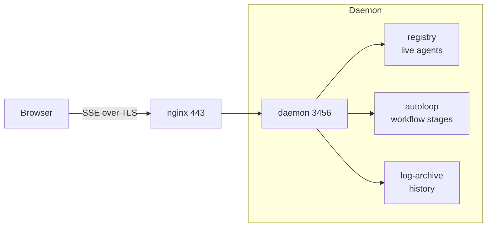

# machina Dashboard

A web dashboard for monitoring and managing the machina orchestrator. See the [orchestrator hub](../README.md) for the big picture.

## Quick Start

The dashboard is **enabled by default**. Once the daemon is running, open:

```text
http://localhost:3456/dashboard
```

No authentication is required on localhost.

## Features

| Feature | Description |
|---------|-------------|
| **Active Agents** | Live view of all running agent containers with role, issue, TTL progress, and last activity |
| **Workflow** (default tab) | Pipeline funnel showing issue counts across all stages with human-gate indicators, agent-active pulse, and an attention panel surfacing only issues needing operator input, grouped by urgency (escalated → awaiting approval → blocked → stale) with inline `[Approve]`, `[Reject]`, `[Boot]`, and `[Reassign]` actions |
| **Issues** | All open GitHub issues grouped by pipeline status, with inline status/priority management, dependency tracking, and stale issue indicators |
| **Usage** | Token usage breakdown by role, issue, agent, and day |
| **History** | Completed agent sessions with duration, token usage, exit status, and expandable execution logs |
| **Real-time updates** | Server-Sent Events push changes instantly (agent start/stop/update, issue label changes) |

<!-- screenshot: dashboard Workflow tab (pipeline funnel + attention panel) -->
<!-- screenshot: dashboard Issues tab (grouped view) -->

## Workflow Tab

The Workflow tab is the default landing tab and provides at-a-glance oversight of the issue pipeline.

### Pipeline Funnel
A 13-stage funnel visualizing issue counts across the full pipeline (`for-define` → `define` → `defined` → `for-implement` → `implement` → ... → `for-merge` → `for-human` → `for-rework`; see `WORKFLOW_PIPELINE_STAGES` in `dashboard.ts`). Each stage shows:
- **Count** — number of issues currently in that stage
- **Human gate indicator** (⏸) — stages that require operator approval (`defined`, `validated`)
- **Warning indicator** (⚠) — `for-human` stage (escalated issues)
- **Agent active pulse** (●) — animated when an agent is working on issues in that stage (respects `prefers-reduced-motion`)

Click any stage to navigate to the Issues tab filtered by that status.

### Attention Panel
A pre-triaged list of issues needing operator input, grouped by urgency tier:

| Tier | Condition | Actions |
|------|-----------|---------|
| Escalated | `for-human` status (rework limit exceeded) | [Reassign], [View] |
| Awaiting approval | `defined` or `validated` status (human gates) | [Approve], [Reject], [View] |
| Blocked | Has unresolved `fritz.depends-on:` dependencies | [View blockers], [View] |
| Stale | No activity for 7+ days with no active agent | [Boot], [View] |

When no issues need attention, the panel shows an "All clear" state with autoloop interval.

### Real-time Updates
The Workflow tab updates automatically via SSE (`issues-update`, `agent-started`, `agent-stopped` events). The attention badge count on the tab label updates in real-time.

## Issues Tab

The Issues tab provides a centralized view of all open GitHub issues with inline management capabilities.

### Views

| View | Behavior |
|------|----------|
| **Grouped view** (default) | Issues grouped by `fritz.status:*` in pipeline order (inbox → backlog → for-define → ... → for-human). Empty groups are hidden. Groups are collapsible. |
| **Flat view** | Single table with sort options (status, priority, newest, oldest, recently updated) |

### Quick Actions
- **Status change** — click the status badge on any issue to open a dropdown with valid statuses. Confirmation required. Changes the `fritz.status:*` label on GitHub.
- **Priority change** — click the priority badge to set P0-P3 or remove priority. Changes the `priority:pN` label on GitHub.
- **Add dependency** — click "+ Dep" to add a `fritz.depends-on:NNN` label linking to another issue
- **Remove dependency** — click the "✕ #NNN" button on the dependency sub-row (confirmation required)

### Filtering
- **Text search** — instant client-side filtering by issue number or title
- **Label filters** — add filter chips (AND logic) to narrow by type, language, repo, status, or priority

### Indicators
- **Blocked issues** — yellow warning with dependency sub-row showing open and resolved dependencies
- **Stale issues** — clock icon for issues not updated in 7+ days (yellow for 14+ days)

### Label Whitelist
Only these label patterns can be modified via the dashboard:
- `fritz.status:*` — pipeline status labels
- `priority:p0` through `priority:p3` — priority labels
- `fritz.depends-on:NNN` — dependency labels

All other labels (type, language, repo, skill, etc.) are read-only in the dashboard.

## Configuration

In `config/fritz.yaml`:

```yaml
dashboard:
  enabled: true   # set to false to disable
```

## API Endpoints

| Endpoint | Method | Auth | Description |
|---|---|---|---|
| `/dashboard` | GET | None | Serves the single-page HTML dashboard |
| `/api/dashboard/state` | GET | None | Full state snapshot (agents, history, system) |
| `/api/dashboard/events` | GET | None | SSE stream for real-time updates |
| `/api/dashboard/history` | GET | None | Paginated history with optional `?role=&issue=&limit=&offset=` (limit max 200) |
| `/api/dashboard/log/:name` | GET | None | Archived execution log for a specific agent (`?lines=` max 500) |
| `/api/dashboard/session-log/:name` | GET | None | Parsed JSONL session timeline for a specific agent (`?full=true` for untruncated) |
| `/api/dashboard/agent-log/:name` | GET | None | Live log for an active (running) agent (`?lines=` max 500) |
| `/api/dashboard/issue-trail/:issue` | GET | None | Agent trail for an issue — all archived agents that worked on it |
| `/api/dashboard/workflow` | GET | None | Pipeline funnel data + attention panel items (computed from issues + active agents) |
| `/api/dashboard/issues` | GET | None | All open issues with status, priority, labels, and dependency data (30s cache) |
| `/api/dashboard/issues/:number` | GET | None | Single issue detail (number, title, state, labels) |
| `/api/dashboard/issues/:number/label` | POST | None | Add/remove labels on an issue (whitelist: `fritz.status:*`, `priority:p*`, `fritz.depends-on:*`) |
| `/api/dashboard/issues/:number/comment` | POST | None | Post a comment on an issue (body: `{ comment: string }`, uses stdin to avoid shell injection) |
| `/api/dashboard/agent/:name/stop` | POST | None | Stop an active agent container |
| `/api/dashboard/boot` | POST | None | Boot a new agent for an issue (body: `{ issue: number, role: string }`) |
| `/api/dashboard/autoloop/toggle` | POST | None | Toggle manual autoloop pause/resume |
| `/api/dashboard/usage` | GET | None | Aggregate usage stats (today + last 7 days token counts) |
| `/api/dashboard/usage/breakdown` | GET | None | Detailed usage breakdown by role, issue, agent, and day (`?since=&until=` ISO dates) |
| `/api/dashboard/subscription-usage` | GET | None | Real-time subscription usage from Anthropic API (with pause/override status) |
| `/api/dashboard/subscription-usage/override` | POST | None | Toggle usage override (body: `{ enabled: boolean }`) |
| `/api/dashboard/agents/max` | GET | None | Current max parallel agents and active count |
| `/api/dashboard/agents/max` | POST | None | Set max agents at runtime (body: `{ max: integer }`, range 1–20, persists to `fritz.yaml`) |

### Runtime Controls

The Settings tab includes a **Runtime Controls** section with the following controls:

| Control | Description |
|---------|-------------|
| **Autoloop** | Pause/resume the autoloop pipeline |
| **Max Agents** | Stepper (`[−] [N] [+]`) to adjust max parallel agents (1–20). Shows `X active / Y max`. Changes take effect immediately and persist to `fritz.yaml`. |
| **Usage Override** | Bypass usage-based pause |
| **Notification Mode** | Set Telegram notification verbosity |
| **GitHub Comments** | Set GitHub comment level |

### SSE Events

| Event | Data | When |
|---|---|---|
| `state` | Full dashboard state | On initial connection |
| `agent-started` | Agent details | New agent registered |
| `agent-update` | Agent details | Agent activity/metadata update |
| `agent-stopped` | History entry | Agent deregistered |
| `heartbeat` | System status | Every 30 seconds |
| `issues-update` | Label change details | After label change via dashboard |
| `usage-update` | System status | When usage monitor state changes (pause/resume/override) |
| `system-update` | System status | When system settings change (e.g., max agents updated) |

## Remote Access

For remote access, the `nginx` reverse proxy (`fritz-nginx` container in `docker-compose.prod.yml`) terminates TLS in front of the daemon. There is **no** client-certificate / mutual-TLS auth — remote access is gated by TLS plus network isolation (the proxy is not published to the host; it is reached over Tailscale via your Tailscale edge router).

### Start the stack

```bash
docker compose -f docker-compose.prod.yml up -d
```

The nginx container mounts `nginx/nginx.conf` and the host's `/etc/letsencrypt` directory (read-only) for its TLS server certificate. `FRITZ_DOMAIN` (default `fritz.example.com`) sets the server name.

### Path restriction

The proxy forwards only the dashboard surface — every other path returns `444` (connection closed), so the agent API is never exposed externally:

- `/dashboard` — dashboard SPA
- `/api/dashboard/*` — dashboard API + SSE
- `/system-map` — live topology visualization

### Security

- TLS 1.3 only, server certificate only (no client-cert verification)
- `X-Frame-Options: DENY`, `X-Content-Type-Options: nosniff`, `Referrer-Policy: no-referrer`
- nginx `proxy_http_version 1.1` with buffering off for proper SSE support

## Architecture



The dashboard is a single self-contained HTML file with inline CSS and JavaScript (no build tools, no npm dependencies). It uses Server-Sent Events for real-time updates and falls back to polling if SSE is unavailable.

Registry change hooks notify connected SSE clients immediately when agents are registered, updated, or deregistered.
