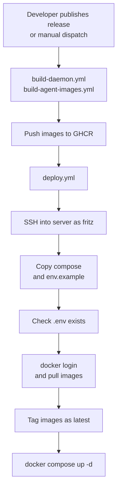

# machina Deployment Guide

Provision a server and deploy machina as Docker containers via GitHub Actions. For the full picture, see the [machina orchestrator README](../README.md).

## Contents

- [Overview](#overview)
- [Server requirements](#server-requirements)
- [Provisioning a new server](#provisioning-a-new-server)
- [Deployment via GitHub Actions](#deployment-via-github-actions)
- [Dashboard remote access (optional)](#dashboard-remote-access-optional)
- [Server directory structure](#server-directory-structure)
- [Monitoring and maintenance](#monitoring-and-maintenance)
- [Troubleshooting](#troubleshooting)
- [Configuration](#configuration)

## Overview

machina is deployed as a Docker-based system via GitHub Actions CI/CD:

- **Daemon + agents** run as Docker containers
- **CI/CD**: `build-daemon.yml` + `build-agent-images.yml` build and push images to GHCR; `deploy.yml` deploys via SSH; `build-and-deploy.yml` combines build + deploy in one workflow
- **No manual git clone on server** — the deploy workflow copies `docker-compose.prod.yml` and pulls pre-built images



## Server requirements

### Recommended specs

| Use case | vCPUs | RAM | Storage | Cost |
|----------|-------|-----|---------|------|
| Development/testing | 2 | 4 GB | 20 GB | ~EUR 8-10/month (a small cloud VPS) |
| Production | 4 | 8 GB | 40 GB | ~EUR 25/month (a standard cloud VPS) |

### Why these specs?

- Good CPU performance for running multiple Claude Code agents
- Sufficient RAM for daemon container + concurrent agent containers
- Fast storage for agent workspaces
- Stable network for Telegram/GitHub/Anthropic APIs

### Supported platforms

- Ubuntu 22.04 LTS (recommended)
- Debian 11+
- Any Linux distribution with Docker support

## Provisioning a new server

### 1. Initial server setup

```bash
# SSH as root
ssh root@<your-server-ip>

# Update system
apt-get update && apt-get upgrade -y

# Install essential tools
apt-get install -y git curl
```

### 2. Install Docker and Docker Compose

```bash
# Install Docker (official method)
curl -fsSL https://get.docker.com | sh

# Verify
docker --version
docker compose version
```

### 3. Install GitHub CLI

```bash
curl -fsSL https://cli.github.com/packages/githubcli-archive-keyring.gpg \
  | dd of=/usr/share/keyrings/githubcli-archive-keyring.gpg
chmod go+r /usr/share/keyrings/githubcli-archive-keyring.gpg
echo "deb [arch=$(dpkg --print-architecture) signed-by=/usr/share/keyrings/githubcli-archive-keyring.gpg] https://cli.github.com/packages stable main" \
  | tee /etc/apt/sources.list.d/github-cli.list > /dev/null
apt-get update && apt-get install -y gh
```

### 4. Create the fritz service user

```bash
# Create dedicated service user with home directory
sudo useradd -r -m -s /bin/bash -d /home/fritz fritz

# Add to docker group (so fritz can run Docker commands)
sudo usermod -aG docker fritz

# Create deployment directory
sudo mkdir -p /opt/fritz
sudo chown fritz:fritz /opt/fritz
```

### 5. Install Claude Code (as fritz)

```bash
# Switch to fritz user
su - fritz

# Install Claude Code
curl -fsSL https://claude.ai/install.sh | bash

# Authenticate (creates ~/.claude/ with subscription credentials)
claude setup-token

# Verify installation
claude --version
ls -la ~/.claude/
# Should contain: .credentials.json, subscription_token.json

# Protect credentials
chmod 700 ~/.claude

# Return to root
exit
```

> [!IMPORTANT]
> Credentials are account-bound and cannot be transferred between machines. You must run `claude setup-token` on each server.

### 6. Set up SSH key for GitHub Actions deployment

```bash
# Option A: Add the deploy key's public key to fritz's authorized_keys
# (The private key goes into GitHub Secrets as SSH_PRIVATE_KEY)
mkdir -p /home/fritz/.ssh
# Add your deploy public key:
echo "ssh-ed25519 AAAA... github-actions-fritz" >> /home/fritz/.ssh/authorized_keys
chmod 700 /home/fritz/.ssh
chmod 600 /home/fritz/.ssh/authorized_keys
chown -R fritz:fritz /home/fritz/.ssh

# Option B: Set SSH_USER in GitHub secrets to a different user that can sudo
```

### 7. Create .env

Create the environment file manually on the server (this is done once; the deploy workflow does not overwrite it):

```bash
cat > /opt/fritz/.env << 'EOF'
# Telegram Configuration
TELEGRAM_BOT_TOKEN=123456:ABC-DEF...
TELEGRAM_CHAT_ID=-100...

# GitHub Configuration
GH_TOKEN=ghp_xxxxx
GITHUB_REPO=owner/repo

# Docker-in-Docker path mapping (required for production)
HOST_WORKSPACES_DIR=/opt/fritz/.workspaces
HOST_CLAUDE_HOME=/home/fritz/.claude
HOME=/home/fritz

# Model configuration: see config/fritz.yaml

# Optional: Telegram Topics — configure in config/fritz.yaml (telegram.topics section)
EOF

# Secure it
chmod 600 /opt/fritz/.env
chown fritz:fritz /opt/fritz/.env
```

> [!CAUTION]
> `.env` holds live Telegram and GitHub secrets. Keep it `chmod 600` and owned by `fritz`, and never commit it. See `.env.example` for all available variables.

### 8. Configure GitHub Secrets

In your repository settings (Settings > Secrets and variables > Actions), add:

| Secret | Value |
|--------|-------|
| `SSH_HOST` | Server IP address |
| `SSH_USER` | `fritz` |
| `SSH_PRIVATE_KEY` | Private key for SSH deployment |

`GITHUB_TOKEN` is automatic and does not need to be set.

### 9. Deploy

> [!WARNING]
> Deploying runs `docker compose up -d` on the live server and restarts the daemon and agent containers. Any work in progress on the server is interrupted while containers cycle.

```bash
# Option A: Push a version tag (triggers build + you manually trigger deploy)
git tag v1.0.0 && git push origin v1.0.0

# Option B: Trigger workflows manually from GitHub Actions UI
# 1. Run build-daemon.yml (and/or build-agent-images.yml)
# 2. Run deploy.yml

# Verify deployment
ssh fritz@<server-ip> 'cd /opt/fritz && docker compose ps'
```

## Deployment via GitHub Actions

### build-daemon.yml

**Triggers:** Manual dispatch, called by `build-and-deploy.yml`

**What it does:**

1. Builds the `fritz-daemon` Docker image
2. Pushes to `ghcr.io/your-org/fritz-daemon`
3. Tags with git SHA and `latest`

### build-agent-images.yml

**Triggers:** Manual dispatch

**What it does:**

1. Builds `fritz-agent` Docker images (base, Java, C++ variants)
2. Pushes to `ghcr.io/your-org/fritz-agent`, `ghcr.io/your-org/fritz-agent-java`, `ghcr.io/your-org/fritz-agent-cpp`

### deploy.yml

**Triggers:** Manual dispatch (with environment and optional `image_tag` input), called by `build-and-deploy.yml`

**What it does:**

1. SSHs into the production server as `$SSH_USER`
2. Copies `docker-compose.prod.yml` to `/opt/fritz/docker-compose.yml`
3. Copies `.env.example` to `/opt/fritz/.env.example`
4. Verifies `.env` exists (must be created manually once)
5. Logs into GHCR, pulls both images
6. Tags images as `fritz-daemon:latest` and `fritz-agent:latest`
7. Runs `docker compose up -d`
8. Verifies containers are running
9. Cleans up old Docker images

### build-and-deploy.yml

**Triggers:** Release published, manual dispatch

**What it does:**

1. Calls `build-daemon.yml` to build and push the daemon image
2. Calls `deploy.yml` to deploy to the server

### How to deploy

1. **Create a release** on GitHub (or push a release tag)
2. `build-and-deploy.yml` triggers automatically on release publish — builds the daemon image and deploys
3. Or trigger `build-daemon.yml` and `deploy.yml` manually from the Actions tab

## Dashboard remote access (optional)

Remote dashboard access goes through the `nginx` reverse proxy defined in `docker-compose.prod.yml`. nginx terminates TLS with a Let's Encrypt **server** certificate (mounted read-only from `/etc/letsencrypt`) and exposes only the dashboard routes — `/dashboard`, `/api/dashboard/`, and `/system-map` — returning `444` (connection closed) for every other path (see `nginx/nginx.conf`).

> [!CAUTION]
> There is no client-certificate / mutual-TLS auth. The network posture is a Let's Encrypt TLS server certificate + Tailscale private network + nginx path allowlist returning `444` for everything else. The nginx service publishes no host ports (`ports: []`); it is reachable over the private Tailscale network via your Tailscale edge router acting as an L4 SNI proxy, so Tailscale network membership is the access-control layer.

1. Set the proxy domain in `/opt/fritz/.env` (nginx `server_name`; defaults to `fritz.example.com`):

   ```bash
   FRITZ_DOMAIN=your-server.example.com
   ```

2. Ensure the Let's Encrypt certificate that `nginx/nginx.conf` references (under `/etc/letsencrypt/live/`) exists on the host.

3. Restart the stack:

   ```bash
   cd /opt/fritz && docker compose up -d
   ```

See the [dashboard guide](DASHBOARD.md) for full details.

## Server directory structure

After deployment, the server looks like:

```text
/opt/fritz/
├── docker-compose.yml    # Copied from docker-compose.prod.yml by deploy workflow
├── .env                  # Created manually once on server
├── .env.example          # Copied by deploy workflow
├── nginx/                # nginx config (copied by deploy workflow)
│   └── nginx.conf
├── mtls/                 # created empty by the deploy workflow; unused
│   └── certs/            # (TLS server cert comes from the host's /etc/letsencrypt)
└── .workspaces/          # Created at runtime by daemon
    ├── fritz/             # Orchestrator workspace
    ├── implement-18/      # Agent workspaces...
    └── review-20/

/home/fritz/
└── .claude/              # Claude Code subscription credentials
    ├── .credentials.json
    └── subscription_token.json
```

## Monitoring and maintenance

### Check status

```bash
# Container status
ssh fritz@<server> 'cd /opt/fritz && docker compose ps'

# All machina containers (including agents)
ssh fritz@<server> 'docker ps --filter "name=fritz-"'

# From Telegram
fritz status
```

### View logs

```bash
# Daemon logs
docker compose -f /opt/fritz/docker-compose.yml logs -f

# Specific agent logs
docker logs fritz-agent-<name>

# Follow all machina container logs
docker logs -f fritz-daemon
```

### Workspace cleanup

Workspaces are cleaned up automatically by the watchdog. Old directories (older than `daemon.workspaceMaxAgeHours` in `fritz.yaml`, default 24h) that are not associated with a running agent are removed each check cycle.

You can also trigger cleanup manually via Telegram:

```text
/cleanup        — remove workspaces older than the configured default
/cleanup 48     — remove workspaces older than 48 hours
/cleanup 0      — remove all non-active workspaces regardless of age
```

To disable automatic cleanup, set `daemon.workspaceMaxAgeHours: 0` in `fritz.yaml`.

**Manual fallback** (if the daemon is not running):

> [!WARNING]
> `rm -rf` permanently deletes workspace directories. Double-check the path and the `-not -name` guards before running it, and never point it outside `/opt/fritz/.workspaces/`.

```bash
# List workspaces
ls -la /opt/fritz/.workspaces/

# Remove old agent workspaces (older than 7 days)
find /opt/fritz/.workspaces/ -maxdepth 1 -type d -mtime +7 \
  -not -name '.workspaces' -not -name 'fritz' -exec rm -rf {} +
```

### Update deployment

Trigger the deploy workflow — images are rebuilt automatically:

1. Create a release on GitHub (or trigger workflows manually)
2. `build-and-deploy.yml` builds the daemon image and deploys
3. For agent images, run `build-agent-images.yml` separately when needed

No manual `git pull` or `npm install` needed on the server.

## Troubleshooting

### Container not starting

```bash
# Check compose logs
cd /opt/fritz && docker compose logs

# Check daemon container specifically
docker logs fritz-daemon

# Verify images exist
docker images | grep fritz
```

### Agent credential issues

```bash
# Check credentials were copied into agent workspace
ls -la /opt/fritz/.workspaces/<agent-name>/.claude/

# Verify permissions (should be 0444 read-only)
stat /opt/fritz/.workspaces/<agent-name>/.claude/.credentials.json

# Check daemon logs for credential copy messages
docker logs fritz-daemon 2>&1 | grep -i "credential\|claude home"
```

### Claude auth not working

```bash
# SSH as fritz user and verify Claude Code
ssh fritz@<server>
claude --version
ls -la ~/.claude/

# Re-authenticate if needed
claude setup-token

# Restart containers
cd /opt/fritz && docker compose restart
```

### Docker socket issues

```bash
# Verify fritz is in docker group
groups fritz

# Check socket permissions
ls -la /var/run/docker.sock

# If needed, re-add to group (requires re-login)
sudo usermod -aG docker fritz
```

### Agent not spawning

```bash
# Check if agent image exists
docker images | grep fritz-agent

# Check daemon logs for spawn errors
docker logs fritz-daemon 2>&1 | grep -i "spawn\|agent\|error"

# Verify Docker socket is mounted
docker inspect fritz-daemon | grep -A5 docker.sock
```

## Configuration

- See `.env.example` for all environment variables and their descriptions
- See the [Docker architecture guide](../DOCKER.md) for container architecture, volume mounts, and credential isolation
- See the [security guide](SECURITY.md) for security hardening and secret management
- See the [CI/CD pipeline guide](CI-CD.md) for the full CI/CD pipeline documentation
