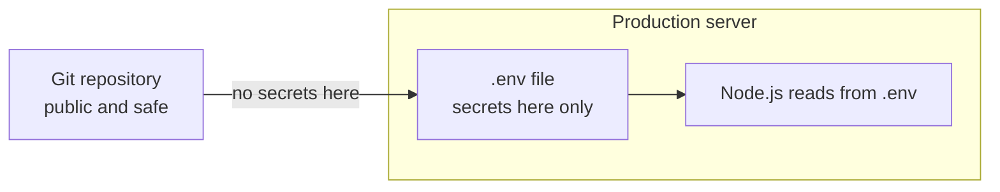

# machina Security Architecture

Security model for the machina deployment. See the [orchestrator hub](../README.md) for the big picture and [API.md](API.md) for endpoint-level auth.

## Contents

- [Overview](#overview)
- [Secret management](#secret-management)
- [How it works](#how-it-works)
- [Authentication methods](#authentication-methods)
- [File permissions](#file-permissions)
- [Dashboard remote access security](#dashboard-remote-access-security)
- [Deployment security checklist](#deployment-security-checklist)
- [Secret rotation](#secret-rotation)
- [Server security](#server-security)
- [Advanced: secret managers](#advanced-secret-managers)
- [Audit and monitoring](#audit--monitoring)
- [Process security](#process-security)
- [Threat model](#threat-model)
- [Incident response](#incident-response)
- [Questions](#questions)

## Overview

machina follows security best practices by **never storing secrets in code or repositories**. All sensitive credentials are managed through environment variables and protected file permissions.

## Secret management

### What's secret (never in git)

| Secret | Purpose |
|--------|---------|
| `ANTHROPIC_API_KEY` | Claude API key (if using API key instead of Claude Code) |
| `TELEGRAM_BOT_TOKEN` | Telegram bot authentication |
| `TELEGRAM_CHAT_ID` | Your Telegram chat ID |
| `GH_TOKEN` | GitHub personal access token |

### What's safe to commit

| Item | Why it's safe |
|------|---------------|
| `.env.example` | Template file (no real values) |
| Source code | No hardcoded credentials |
| Configuration files | Reference env vars only |
| Documentation | Reference only |

## How it works



## Authentication methods

machina supports two authentication methods for Claude API:

### Method 1: Claude Code CLI (Recommended)
- **Setup**: Run `claude setup-token` on server
- **Storage**: Credentials in `~/.claude/` directory
- **Billing**: Subscription-based (fixed monthly cost)
- **Security**: OAuth tokens, automatic refresh
- **Best for**: Production deployments, local development

No `ANTHROPIC_API_KEY` needed in `.env`.

### Method 2: API Key (Fallback)
- **Setup**: Add `ANTHROPIC_API_KEY` to `.env`
- **Storage**: Environment variable only
- **Billing**: Pay-per-token (more expensive)
- **Security**: Static API key
- **Best for**: CI/CD, headless environments

### Docker Deployments (Per-Agent Credential Isolation)

In production, each agent and the orchestrator get their **own isolated** `.claude` directory. The host user's `~/.claude` is never mounted directly into any container.

**How it works:**
1. The daemon reads credentials from the `fritz` user's `~/.claude/` at startup
2. When spawning an agent, the daemon **copies** credential files into `.workspaces/{agent-name}/.claude/`
3. Copies are set to **read-only (0444)** — agents cannot modify them
4. Each agent has a completely independent `.claude` with no shared state

**Setup:**
```bash
# Protect the fritz user's .claude directory
chmod 700 /home/fritz/.claude

# Set host paths in .env for Docker-in-Docker path mapping
HOST_WORKSPACES_DIR=/opt/fritz/.workspaces
HOST_CLAUDE_HOME=/home/fritz/.claude
```

**Why per-agent isolation?**
- Prevents session state pollution between agents
- Prevents the orchestrator's `--continue` flag from picking up agent session history
- Eliminates race conditions from multiple agents writing to the same directory

See [DOCKER.md](../DOCKER.md) for the full credential flow and volume mount architecture.

## File permissions

### `.env` file (on server only)
```text
-rw-------  1 fritz fritz  256 Jan 26 14:00 .env
```
- Mode: `600` (only owner can read/write)
- Owner: `fritz:fritz` (the dedicated service user)
- **Never committed to git** (`.gitignore` protects this)

**How to set:**
```bash
chmod 600 /opt/fritz/.env
chown fritz:fritz /opt/fritz/.env

# Verify
ls -la /opt/fritz/.env
# Should show: -rw------- 1 fritz fritz
```

### `.env.example` (template, safe to commit)
```text
-rw-r--r--  1 user user  1024 Jan 26 14:00 .env.example
```
- Contains placeholder values only
- Safe to share publicly
- Used as template for creating `.env`

### Claude Code directory (if using CLI auth)
```text
-rwx------  1 user user  ~/.claude/
```
- Contains OAuth tokens
- Auto-managed by Claude Code CLI
- Should not be copied between systems

## Dashboard remote access security

The dashboard supports optional remote access through an nginx reverse proxy, reached over a private Tailscale network (your Tailscale edge router) rather than a public port.

> [!CAUTION]
> The network posture is a Let's Encrypt TLS server certificate + a Tailscale private network + an nginx path allowlist that returns 444 for everything else. There is **no** mutual TLS — the proxy authenticates the server to the browser, not individual users.

### What the proxy provides
- **Server authentication** — browser verifies the TLS server certificate
- **Encryption** — TLS 1.3 only
- **Network isolation** — nginx publishes no host ports (`docker-compose.prod.yml`); it is reachable only through the Tailscale edge router
- **Path restriction** — only `/dashboard`, `/api/dashboard/`, and `/system-map` are proxied; all other paths return 444

### Certificate management
- A standard Let's Encrypt TLS server certificate is mounted read-only from the host's `/etc/letsencrypt` (see `nginx/nginx.conf`)
- Renew it with your normal certbot workflow on the host; nginx serves the renewed files

### Security headers
The nginx proxy adds: `X-Frame-Options: DENY`, `X-Content-Type-Options: nosniff`, `Referrer-Policy: no-referrer`.

### What is NOT protected

> [!WARNING]
> The dashboard on localhost (port 3456) has no authentication — this is intentional for local development. The proxy encrypts and restricts remote access but does not authenticate individual users; keep it bound to the private Tailscale network.

## Deployment security checklist

- [ ] Dedicated `fritz` service user created (not root)
- [ ] `.env` file created at `/opt/fritz/.env` (not in git)
- [ ] `.env` owned by `fritz:fritz` with `chmod 600` permissions
- [ ] `.env` is in `.gitignore` (already configured)
- [ ] No API keys in source code
- [ ] No API keys committed to git history
- [ ] `fritz` user's `~/.claude/` directory has `chmod 700`
- [ ] Per-agent `.claude` isolation verified (credentials copied, not shared)
- [ ] `HOST_WORKSPACES_DIR` and `HOST_CLAUDE_HOME` set in `.env`
- [ ] SSH access uses key-based authentication (not passwords)
- [ ] Dashboard remote access configured (if used): `FRITZ_DOMAIN` set, TLS certificate present under `/etc/letsencrypt`, proxy bound to the private Tailscale network
- [ ] Server firewall configured (ufw or equivalent)
- [ ] Regular security updates enabled

## Secret rotation

If a secret is compromised:

### 1. Anthropic API Key (if using API key method)
```bash
# Get new key from console.anthropic.com
# Update .env on server
nano /opt/fritz/.env

# Restart daemon
cd /opt/fritz && docker compose restart
```

### 2. Claude Code Authentication (if using CLI method)
```bash
# Re-authenticate as the fritz user
su - fritz
claude setup-token

# Restart daemon
cd /opt/fritz && docker compose restart
```

### 3. Telegram Bot Token
```bash
# Message @BotFather on Telegram
/revoke

# Create new bot or regenerate token
/newbot  # Or regenerate existing

# Update .env on server
nano /opt/fritz/.env

# Restart daemon
cd /opt/fritz && docker compose restart
```

### 4. GitHub Token
```bash
# Visit: https://github.com/settings/tokens
# Revoke old token
# Create new token with same scopes

# Update .env on server
nano /opt/fritz/.env

# Restart daemon
cd /opt/fritz && docker compose restart
```

## Server security

### SSH Hardening

```bash
# Edit SSH config
sudo nano /etc/ssh/sshd_config

# Recommended settings:
PermitRootLogin prohibit-password  # Or 'no' to disable root
PasswordAuthentication no          # Use keys only
PubkeyAuthentication yes
Port 2222                          # Change default port (optional)

# Restart SSH
sudo systemctl restart sshd
```

### Firewall Setup

```bash
# Install and configure ufw
sudo apt-get install -y ufw

# Allow SSH (use your custom port if changed)
sudo ufw allow 22/tcp  # Or: sudo ufw allow 2222/tcp

# Allow outbound (for APIs)
sudo ufw default allow outgoing

# Block all other inbound
sudo ufw default deny incoming

# Enable firewall
sudo ufw enable

# Check status
sudo ufw status
```

### Automatic Security Updates

```bash
# Install unattended-upgrades
sudo apt-get install -y unattended-upgrades

# Configure
sudo dpkg-reconfigure --priority=low unattended-upgrades

# Verify enabled
sudo systemctl status unattended-upgrades
```

## Advanced: secret managers

For production deployments, consider using a secret manager:

### HashiCorp Vault
```bash
# Store secrets
vault kv put secret/fritz \
  telegram_bot_token=$TELEGRAM_BOT_TOKEN \
  gh_token=$GH_TOKEN

# Fetch at startup
vault kv get -field=telegram_bot_token secret/fritz
```

### AWS Secrets Manager (if using AWS)
```bash
# Create secret
aws secretsmanager create-secret \
  --name fritz/telegram-token \
  --secret-string $TELEGRAM_BOT_TOKEN

# Fetch at startup
aws secretsmanager get-secret-value \
  --secret-id fritz/telegram-token \
  --query SecretString \
  --output text
```

## Audit & monitoring

### Check for Secret Leaks

```bash
# Verify no secrets in git history
git grep -i "sk-ant-" $(git rev-list --all)
git grep -i "ghp_" $(git rev-list --all)

# Check .env is gitignored
git check-ignore .env  # Should output: .env

# Verify .env permissions
ls -la .env  # Should show: -rw------- (600)
```

### Monitor Access

```bash
# Check who can read .env
ls -la /opt/fritz/.env

# Check recent .env access (requires auditd)
sudo auditctl -w /opt/fritz/.env -p r -k fritz-secrets
sudo ausearch -k fritz-secrets
```

### Log Security

```bash
# Ensure no secrets in container logs
docker compose -f /opt/fritz/docker-compose.yml logs | grep -i "sk-ant\|ghp_\|token"
# Should return nothing

# Review application logs
docker compose -f /opt/fritz/docker-compose.yml logs -f
# Ensure no sensitive data logged
```

## Process security

### Service User

Production runs under a dedicated `fritz` service user (not root):

```bash
# Create the fritz service user
sudo useradd -r -m -s /bin/bash -d /home/fritz fritz
sudo usermod -aG docker fritz

# Set ownership of deployment directory
sudo chown fritz:fritz /opt/fritz

# Protect credentials
chmod 700 /home/fritz/.claude
```

### Container Isolation

```bash
# Containers run with limited privileges
# Docker Compose manages the daemon container
# Agent containers are spawned as sibling containers via Docker socket
# Each agent gets isolated credentials (copied, read-only)

# Verify running containers
docker ps --filter "name=fritz-"

# Check container user
docker exec fritz-daemon whoami
```

## Threat model

### What this protects against
- Accidental git commits of secrets
- Source code disclosure (no hardcoded keys)
- Public repository cloning (secrets not included)
- Unauthorized local access (file permissions)

### What you must still protect

> [!WARNING]
> These are outside the scope of the secret-management model and remain your responsibility.

- Server SSH access (use key-based auth)
- `.env` file on disk (use `chmod 600`)
- Process environment (visible to root and process owner)
- Log files (ensure no secrets logged)
- Backup files (may contain `.env`, protect them)
- Memory dumps (may contain secrets in RAM)

## Incident response

If you suspect a secret has been compromised:

1. **Immediately rotate the secret** (see Secret Rotation above)
2. **Review access logs** for unauthorized activity
3. **Check git history** for accidental commits
4. **Audit running processes** for suspicious activity
5. **Review recent Telegram/GitHub activity** for unauthorized actions

### If .env was committed to git:

```bash
# 1. Rotate ALL secrets immediately
# 2. Remove from git history
git filter-repo --invert-paths --path fritz-orchestrator/daemon/.env

# 3. Force push (if you have permission)
git push --force origin main

# 4. Notify team members to re-clone
```

## Questions?

### Can I publish my fork to GitHub?
Yes! Just ensure `.env` stays gitignored (it already is).

### Can I share my repository publicly?
Yes! No secrets are in the code.

### What if I accidentally committed `.env`?
Immediately rotate all secrets, then remove from git history using `git filter-repo`.

### Can I use system environment variables instead of `.env`?
Yes! The daemon reads from both `.env` and system environment.

### How do I back up my deployment?
Back up the code (from git) and the `.env` file separately. Encrypt `.env` backups:
```bash
# Encrypt .env for backup
gpg -c .env  # Creates .env.gpg
# Store .env.gpg securely, delete unencrypted backup
```

---

> [!IMPORTANT]
> Secrets belong in the environment, never in code or repositories.
