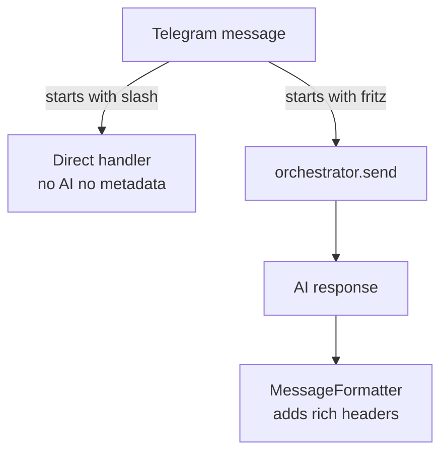
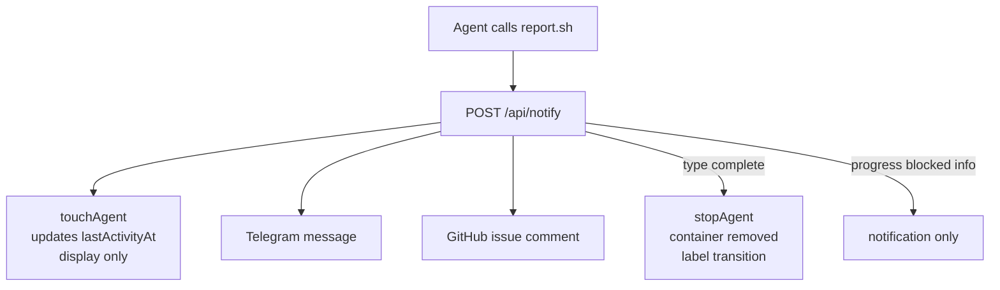

# machina Telegram Bot

Part of the [machina orchestrator](../README.md). For first-time bot creation and `.env` wiring, see [TELEGRAM_SETUP.md](TELEGRAM_SETUP.md).

## Overview

The machina Telegram bot provides a mobile-friendly interface for managing the orchestrator and agents. All messages include rich metadata headers showing source, context, and timestamp.

### Design Goals

**Purpose**: Manage multi-agent workflows remotely with natural AI communication

**Key Jobs**:
- Monitor workflow progress from mobile ("fritz status")
- Communicate naturally with Claude Code orchestrator
- Understand which agent/skill is communicating (via headers)
- Chat naturally with AI for any questions or tasks

**Why This Design**:
- Box chars (┏━┓) for clean visual separation on mobile
- Minimal headers (2-3 lines max) - context without clutter
- All "fritz [message]" routes to AI - no special parsing
- Emoji for quick visual recognition (⚡ orchestrator, 🔨 agents)
- Context preserved across messages for natural conversation

**Differentiation**:
- vs GitHub Mobile: Natural language, AI-powered, instant
- vs SSH/CLI: Available on mobile, no terminal needed
- vs Other AI: Full codebase context, can spawn agents and take actions

## Rich Metadata Headers

All orchestrator responses now include formatted headers:

### Orchestrator Messages
```text
┏━━━━━━━━━━━━━━━━━━━━━━━┓
┃ ⚡ orchestrator       ┃
┃ session-3 • 14:25     ┃
┗━━━━━━━━━━━━━━━━━━━━━━━┛

[Response content]
```

### Agent Messages
```text
┏━━━━━━━━━━━━━━━━━━━━━━━┓
┃ 🔨 impl-7 • #42       ┃
┃ your-org/fritZ • 14:25 ┃
┗━━━━━━━━━━━━━━━━━━━━━━━┛

[Agent update]
```

## Commands

### Natural Language

Use "fritz [message]" for natural conversation with the AI orchestrator:

```text
fritz status
fritz what's blocking issue #42?
fritz plan notification system
fritz run pipeline
fritz retro scan --since=2026-02-10
fritz help me debug the auth system
```

**All** "fritz [message]" text is routed to the Claude Code orchestrator for intelligent AI responses.

### Direct Agent Management Commands

These commands work directly without AI routing:

| Command | Effect |
|---------|--------|
| `/boot <role> [issue] [repo] [--force]` | Start an agent (use `--force` to bypass the parallel agent limit) |
| `/status` | Show all agents |
| `/stop <name>` | Stop an agent |
| `/logs <name>` | View agent logs |
| `/cleanup [hours]` | Remove old workspaces (default: configured `daemon.workspaceMaxAgeHours` in `fritz.yaml`, use `0` for all non-active) |

### Scheduler Commands

Manage the periodic task scheduler via `fritz schedule`:

| Command | Effect |
|---------|--------|
| `fritz schedule` / `fritz schedule list` | List all scheduled jobs with status, next run, and last run info |
| `fritz schedule trigger <job-id>` | Manually trigger a scheduled job (creates a GitHub issue immediately) |
| `fritz schedule enable <job-id>` | Enable a disabled job at runtime |
| `fritz schedule disable <job-id>` | Disable a job at runtime (persists across restarts) |

Jobs are configured in `fritz.yaml` under the `scheduler` section. See [Issue #328](https://github.com/hilsbos/machina/issues/328) for the full technical specification.

## Message Features

### Intelligent Splitting

Long responses (>4096 chars) are automatically split at paragraph boundaries:

```text
[First chunk]
(1/3)

[Second chunk]
(2/3)

[Third chunk]
(3/3)
```

### Context Preservation

The orchestrator maintains conversation context across messages:

```text
You: fritz what's in the backlog?
Bot: [Lists backlog items]

You: fritz let's work on the first one
Bot: [Understands "first one" from previous context]
```

### Time-Aware Formatting

Timestamps show time for today, date + time for older messages:

- Today: `14:25`
- Yesterday/older: `Jan 25 14:25`

## Architecture

### Components

1. **telegram.ts** - Telegraf bot with inline routing logic
2. **orchestrator.ts** - Manages Claude Code container
3. **message-formatter.ts** - Generates rich headers and splits messages
4. **telegram-helpers.ts** - Utility functions (parseArgs, metadata creation, error formatting)

### Message Flow

Inbound messages are routed by prefix — `/` commands run directly, everything else goes to the AI orchestrator:



Agent notifications fan out to Telegram and GitHub, and completion stops the container:



On completion the agent's label transitions (active → for-review / for-validate, etc.). User → agent messages (`/tell`, reply) also call `touchAgent()` to refresh the last-activity display.

> [!NOTE]
> `touchAgent()` only refreshes the last-activity display. TTL is wall-clock from agent start and does not reset on activity.

### Design Principles

- **Inline routing** - Simple, direct logic in telegram.ts (no abstraction layer)
- **Pure AI** - All "fritz [message]" goes to Claude Code orchestrator
- **Minimal duplication** - Shared utilities in telegram-helpers.ts
- **Lifecycle compatibility** - Agent notifications use simple format without metadata
- **Completion-driven** - Agent completion notifications trigger container stop and label transitions via api.ts

## Configuration

No configuration changes needed. The bot automatically:

- Detects orchestrator mode
- Routes messages appropriately
- Formats responses with metadata

## Examples

### Workflow Status

```text
User: fritz status
Bot:
┏━━━━━━━━━━━━━━━━━━━━━━━┓
┃ ⚡ orchestrator       ┃
┃ 14:25                 ┃
┗━━━━━━━━━━━━━━━━━━━━━━━┛

Current Status:
✅ 2 stories completed
🔄 1 in review (#42)
⏸️ 1 blocked (#43 - needs design)

Days remaining: 3
Velocity: On track
```

### Agent Update

```text
Agent:
┏━━━━━━━━━━━━━━━━━━━━━━━┓
┃ 🔨 impl-7 • #42       ┃
┃ your-org/fritZ • 15:30 ┃
┗━━━━━━━━━━━━━━━━━━━━━━━┛

✅ Implementation complete

PR #156 ready for review
- Added notification service
- 12 tests passing
- Updated docs
```

## Mobile Experience

Optimized for Telegram mobile apps:

- **Minimal headers** - 2-3 lines max
- **Clear hierarchy** - Box chars create visual separation
- **Status emojis** - Quick visual parsing (✅🔄⏸️❌)
- **Smart splitting** - Paragraph-aware chunking
- **Context aware** - No need to repeat information

## Implementation Details

### Files
- `telegram.ts` - Main bot with inline routing logic
- `api.ts` - HTTP API for agent notifications; triggers container stop on completion
- `message-formatter.ts` - Rich headers and message splitting (199 LOC)
- `telegram-helpers.ts` - Utility functions (21 LOC)
- `orchestrator.ts` - Claude Code container management (enhanced with commandHint)

### Technical Approach
- **Inline routing** - Simple, direct logic in telegram.ts (no abstraction needed)
- **Pure AI** - All "fritz [message]" goes to Claude Code orchestrator
- **Intelligent splitting** - Messages >4096 chars split at paragraph boundaries
- **Zero dependencies** - Built on existing Telegraf and orchestrator

### Stats
- Net new code: ~200 LOC (after removing duplication)
- TypeScript compilation: Passing
- Implementation time: ~3 days

---

**Feature**: Telegram Orchestrator Bot
**Issue**: #5
**RICE Score**: 80 (High Priority)
**Implemented**: 2026-01-26
