# machina System Architecture

System design reference for the machina daemon, its isolated agent containers, and the GitHub-label-driven pipeline. For setup and day-to-day operations, see the [root README](../../README.md) and the [orchestrator hub](../../fritz-orchestrator/README.md).

## Contents

- [Overview](#overview)
- [Components](#components)
- [How to run](#how-to-run)
- [Data flow](#data-flow)
- [File structure](#file-structure)
- [Agent lifecycle](#agent-lifecycle)
- [Issue workflow](#issue-workflow)
- [Status update pattern](#status-update-pattern)
- [Configuration](#configuration)
- [Multi-repo support](#multi-repo-support)
- [Invocation mode handling](#invocation-mode-handling)
- [Diagnosis data flow](#diagnosis-data-flow)
- [Agent communication](#agent-communication-persistent-interactive-sessions)
- [Retro agent archive integration](#retro-agent--archive-api-integration)
- [Dashboard](#dashboard)
- [Usage monitor](#usage-monitor)
- [Feedback manager](#feedback-manager)
- [Scheduler](#scheduler)
- [Event log](#event-log)
- [GitHub state management](#github-state-management-phased-approach)
- [Security](#security)

## Overview

Telegram is the control plane. The daemon runs on the host and manages short-lived agent containers plus an nginx sidecar; each agent is an isolated Claude Code container with a mounted workspace, a role identity, and a task assignment.

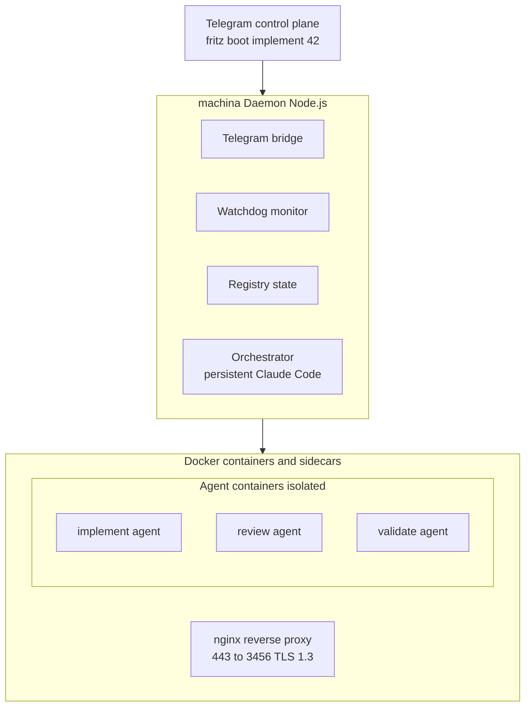

Each agent container runs Claude Code with a mounted workspace, a role-specific identity (`.fritz/identity.md`), and a task assignment (`.fritz/assignment.md`). The nginx sidecar is a reverse proxy for the dashboard only (TLS 1.3, Let's Encrypt wildcard cert for `*.example.com`).

## Components

### Telegram (Control Plane)
- Natural language commands ("fritz ...")
- Agent status and notifications
- Chat with Claude Code directly
- **Edit-in-place updates**: Progress updates edit a single status message instead of sending multiple messages, reducing notification spam (configurable via `telegram.editInPlaceEnabled` in `fritz.yaml`)
- **Notification modes**: Four verbosity levels for lifecycle notifications — `essential` (only questions, problems, direct replies, and chat-mode hello — blocked, failed, agent_response, hello_chat), `quiet` (warnings/errors only), `compact` (one message per agent, updated in-place via `editMessageText`), `verbose` (every event gets a new message). Chat-mode agent hello messages (`hello_chat` event) are always delivered regardless of mode because the user needs to know the agent is ready for interaction. Auto-mode agent hello messages remain suppressible. Configured via `telegram.notificationMode` in `fritz.yaml` or toggled at runtime with `fritz mode <mode>`. Note: `editInPlaceEnabled` controls chat session feedback (feedback-manager), while `notificationMode: compact` controls agent lifecycle notifications (lifecycle.ts) — they operate on different message streams and coexist safely.
- **GitHub comment level**: Three verbosity levels for GitHub issue comments — `essential` (only blocked, rework escalation, dependency cycles, conflicts, skill summaries), `quiet` (essential + combined agent start/finish via edit-in-place), `verbose` (every event). Configured via `github.commentLevel` in `fritz.yaml` or toggled at runtime via dashboard. Independent of `telegram.notificationMode`. Gating is handled by `shouldPostComment()` in `github.ts`; in quiet mode, agent-started and agent-finished comments are combined into a single edited comment using `postLifecycleComment()` and `editComment()`.
- **UI Components**:
  - **telegram-buttons.ts** — Inline button factory: agent selection, role selection, confirmation dialogs, boot continuation, callback data encoding (max 64 bytes per callback)
  - **message-sanitizer.ts** — 6-stage sanitization pipeline for Telegram's strict Markdown v1 parser, message chunking for 4096-char limit, entity preservation during edits
  - **message-formatter.ts** — Rich metadata headers, formatting helpers, message splitting at Telegram's character limit
  - **message-tracker.ts** — Maps Telegram message IDs to agent names for reply-to-message routing (tracks up to 1000 messages with LRU trim)
  - **notification-mode.ts** — Notification mode filtering (essential/quiet/compact/verbose), defines `ALWAYS_NOTIFY` and `ESSENTIAL_NOTIFY` event lists

### Focus Mode

Per-chat agent focus for streamlined Telegram interaction.

- **focus.ts** — Maps chatId → agentName for message routing
- When a chat is "focused" on an agent, replies are auto-routed to that agent without needing `/tell`
- Auto-cleared when the focused agent stops

### machina Daemon (Node.js)
- **telegram.ts** - Telegram bot, message routing
- **orchestrator.ts** - Persistent Claude Code orchestrator
- **agents.ts** - Docker container management
- **watchdog.ts** - Health monitoring, wall-clock TTL enforcement (`getExpiredAgents()` in registry.ts), workspace cleanup, log archive cleanup
- **log-archive.ts** - Persistent log archive for agent execution logs (survives workspace cleanup)
- **registry.ts** - Agent state tracking (in-memory cache with debounced JSON file persistence, includes `lastActivity` timestamps)
- **lifecycle.ts** - Telegram notifications
- **diagnose.ts** - System freshness diagnosis (compares local skills/knowledge/config against GitHub `main` using git blob SHA-1 hashes)
- **scheduler.ts** - Periodic task scheduler that creates GitHub issues on configurable schedules (hourly/daily/weekly) to trigger agent tasks like retrospectives and security reviews; disabled by default, configured via `fritz.yaml`
- **dashboard/dashboard.ts** - Web dashboard with SSE real-time updates and operational controls; serves SPA from port 3456, aggregates data from registry, autoloop, log-archive, and agents; provides agent stop/boot, autoloop toggle, usage stats, live logs, issue trail, and retro metrics endpoints

### Docker Agents
- Each agent runs in isolated container
- Claude Code with full capabilities
- Workspace created on host and mounted; credentials are copied during boot (point-in-time snapshots)
- Time-limited (TTL, default 30 min; wall-clock from agent start — does not reset on communication)
- **Image variants**: Agents run on specialized Docker images selected by `fritz.lang:` labels on the GitHub issue. The base image (`fritz-agent`, from `node:20-slim`) includes Node.js, Claude Code, and gh CLI. Variant images (`fritz-agent-java`, `fritz-agent-cpp`) extend from `fritz-agent` adding language toolchains. `fritz-agent-kali` is a standalone image from `kalilinux/kali-rolling` (reinstalls all prerequisites) providing offensive security tools. Image selection is handled by `LABEL_TO_VARIANT` in `agents.ts`; see LANGUAGES.md for full details.

## How to Run

```bash
npm start
```

Features:
- Persistent Claude Code container (orchestrator)
- Full capabilities (git, gh, code)
- Commands: status, boot, stop, logs
- Direct conversation with Claude Code

## Data Flow

### Daemon startup sequence

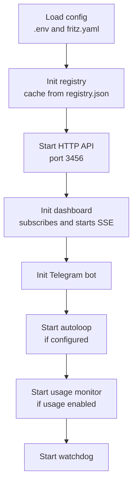

The dashboard step runs only when `dashboard.enabled`; it subscribes to the registry, autoloop, and usage-monitor, then starts the SSE heartbeat. The usage monitor requires an OAuth token and auto-refreshes the credentials-file token.

### Boot agent

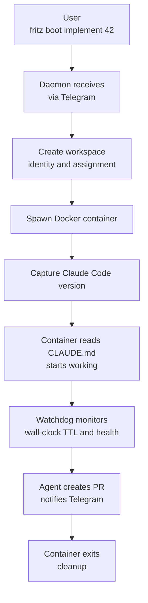

Version capture uses `docker exec claude --version`. TTL is wall-clock from agent start.

### Boot Mode Matrix

The `/boot` command supports different modes for flexible agent usage:

| Boot Command | Mode | Issue Context | Agent Behavior |
|--------------|------|---------------|----------------|
| `/boot implement` | chat | None | Waits for instructions (standby) |
| `/boot implement 42` | auto | Issue #42 | Auto-starts working on issue |
| `/boot implement -chat` | chat | None | Waits for instructions (standby) |
| `/boot implement 42 -chat` | chat | Issue #42 | Has context, waits for instructions |
| `/boot implement 42 --force` | auto | Issue #42 | Bypasses `maxParallelAgents` limit, logs warning |

**Context Loading (Chat Mode with Issue):**
When booting in chat mode with an issue, the daemon pre-loads context into `assignment.md`:
- Issue title, body, and labels
- Last 10 comments (truncated to 500 chars each)
- Up to 5 linked PRs with state

This allows the agent to understand the context immediately without needing to fetch it manually.

**Telegram Welcome Message:**
Chat mode agents receive a context-aware welcome message showing:
- Agent name, role, and TTL
- Context summary (comment count, latest comment preview, related PRs)
- Instructions to reply or use `/tell` to give commands

### Orchestrator message

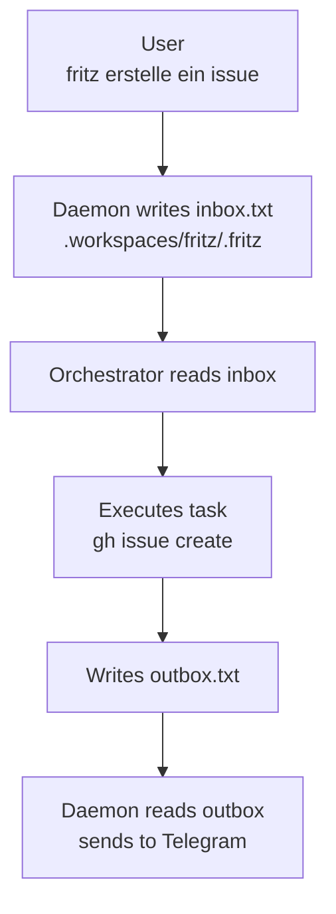

### Orchestrator — Pipeline Planning Role

The orchestrator (machina) is a conversational pipeline planner accessible via Telegram and API:
- The owner (or an external agent system via fritzbridge) describes intent in natural language ("chain the fritzmonitor tickets", "move #617 to the front")
- machina reads the relevant issues, infers ordering, and applies `fritz.depends-on:N` and `priority:p0` labels via `gh issue edit`
- No wave planner, no state machine — label manipulation is the only side effect
- Messages are serialized via a queue (`core/message-queue.ts`) — only one Claude process at a time

**Message relay** (primary path: `POST /fritz/converse` via fritzbridge):
- fritzbridge is an optional bridge to an external agent system, exposing a `/fritz/converse` endpoint
- fritzbridge maintains a persistent NDJSON session to the fritz-orchestrator container (`docker exec -i fritz-orchestrator claude --input-format stream-json`)
- Responses stream back over the persistent session; fritzbridge translates them to async for the external system
- Fallback/alternative: `POST /api/orchestrator/message` on the daemon (sync, blocks up to 180s, max 300s)
- Auth: `validateCallerToken()` (orchestrator token or active agent token)

**Pipeline sequencing:**
- Multiple implement agents can run in parallel on the same repo
- Sequencing is handled explicitly via `fritz.depends-on:` labels (applied at triage/define time)
- `fritz.depends-on:` blocks are enforced every autoloop cycle

**Pipeline events flow:**
- `pipeline.dependency-applied` — orchestrator applied a fritz.depends-on label (planned — not yet emitted)
- Events flow through SSE stream → fritzbridge → external agent system

### Orchestrator knowledge loading

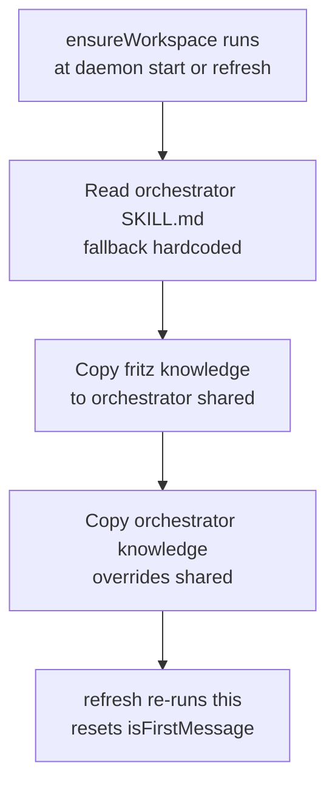

`.claude/orchestrator/SKILL.md` provides the identity; `/refresh` re-runs the sequence and resets `isFirstMessage` for identity re-injection.

## File Structure

```text
fritz-orchestrator/
└── daemon/               # Node.js daemon
    ├── src/
    │   ├── index.ts      # Entry point
    │   ├── config.ts     # Configuration
    │   ├── types.ts      # TypeScript types
    │   ├── runtime.ts    # Docker detection
    │   │
    │   ├── core/         # Core components
    │   │   ├── registry.ts    # Agent state
    │   │   ├── watchdog.ts    # Health monitoring
    │   │   ├── lifecycle.ts   # Lifecycle notifications
    │   │   ├── diagnose.ts    # System freshness diagnosis
    │   │   ├── event-log.ts   # Structured event log (JSONL, 500-entry cap)
    │   │   └── scheduler.ts   # Periodic task scheduler
    │   │
    │   ├── agents/       # Agent management
    │   │   ├── agents.ts          # Container management
    │   │   ├── boot.ts            # Workspace setup
    │   │   ├── autoloop.ts        # Auto-orchestration (priority-sorted spawning)
    │   │   ├── agent-comms.ts     # Persistent sessions + one-shot fallback
    │   │   ├── usage-monitor.ts   # Subscription usage monitoring (OAuth API, auto-pause, auto-refresh)
    │   │   ├── log-archive.ts     # Persistent log archive (survives workspace cleanup)
    │   │   ├── feedback-manager.ts # Chat-mode feedback (typing, progress, timeout)
    │   │   ├── focus.ts           # Per-chat agent focus routing
    │   │   ├── session-parser.ts  # JSONL session log parser (tokens, tools, subagents)
    │   │   ├── priority-utils.ts  # Priority label parsing and issue sorting
    │   │   ├── version-utils.ts   # Claude Code version detection
    │   │   └── fritz-config.ts    # fritz.yaml loader
    │   │
    │   ├── telegram/     # Telegram integration
    │   │   ├── telegram.ts          # Main bot logic, command handlers
    │   │   ├── telegram-buttons.ts  # Inline button factory, callback encoding
    │   │   ├── message-sanitizer.ts # Markdown v1 sanitization pipeline
    │   │   ├── message-formatter.ts # Metadata headers, message splitting
    │   │   ├── message-tracker.ts   # Message-to-agent routing (LRU)
    │   │   ├── notification-mode.ts # Notification verbosity filtering
    │   │   └── telegram-helpers.ts  # Command parsing, error formatting
    │   │
    │   ├── github/       # GitHub integration
    │   │   └── github.ts
    │   │
    │   ├── dashboard/    # Web dashboard
    │   │   └── dashboard.ts  # Route handler + SSE manager
    │   │
    │   ├── api/          # HTTP API
    │   │   └── api.ts
    │   │
    │   └── orchestrator/ # Claude Code
    │       ├── orchestrator.ts
    │       ├── knowledge.ts          # Identity loading + knowledge copy (no config dep)
    │       └── orchestrator.test.ts  # Unit tests for knowledge module
    ├── dashboard-ui.html # Single-file SPA (copied to /app/ in Docker)
    └── package.json

config/
└── fritz.yaml            # Operational config (includes dashboard.enabled)

.claude/
├── skills/               # Agent role definitions
│   ├── implement/SKILL.md
│   ├── review/SKILL.md
│   └── ...
│
├── orchestrator/         # Orchestrator-specific config
│   ├── SKILL.md          # Orchestrator identity/prompt (was hardcoded)
│   └── knowledge/        # Orchestrator-only knowledge files
│       └── README.md
│
└── knowledge/            # Shared knowledge (agents + orchestrator)
    ├── ARCHITECTURE.md   # This file
    ├── CODEBASE.md
    └── ...

.workspaces/              # Agent workspaces (auto-cleaned by watchdog)
├── registry.json         # Agent state
├── logs/archive/         # Persistent log archive (indefinite retention — logArchiveMaxAgeDays: 0)
│   └── implement-42-abc/ # Per-agent archive
│       ├── summary.json  # Metadata, token usage, tool stats
│       ├── agent.log     # Archived agent.log (raw stdout/stderr)
│       └── session.txt   # Parsed Claude Code session timeline (issue #926; only present for agents archived after that fix shipped)
├── fritz/                # Orchestrator workspace (never cleaned)
│   └── .fritz/
│       ├── identity.md
│       ├── inbox.txt
│       └── outbox.txt
└── implement-123456/     # Agent workspace
    ├── .fritz/
    │   ├── identity.md
    │   └── assignment.md
    └── project/          # Cloned repo
```

## Agent Lifecycle

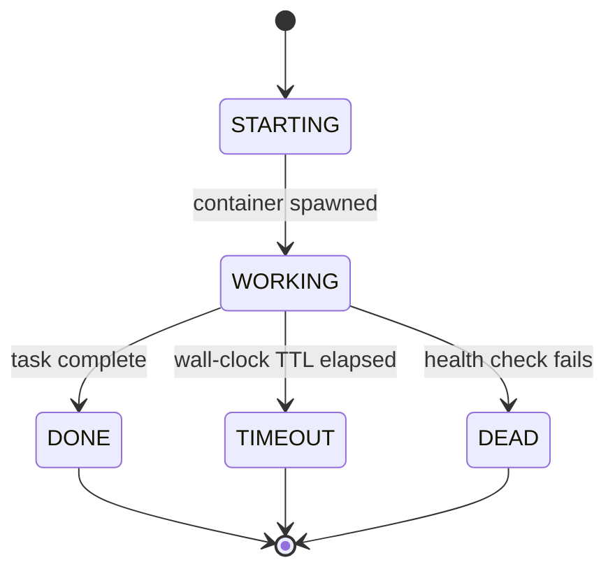

`STARTING` is the container spawning; `WORKING` is the agent executing its task. TTL is wall-clock from agent start, so `TIMEOUT` fires when that wall-clock budget elapses regardless of recent activity.

Communication events (recorded as `lastActivity` for display only — they do **not** reset TTL; TTL is wall-clock from agent start, and the watchdog separately cleans up dead/stale agents):
- Agent → Daemon: `report.sh progress/blocked/complete` (POST /api/notify)
- Agent → Daemon: `report.sh ask` (POST /api/ask)
- User → Agent: `/tell` command in Telegram
- User → Agent: Reply to agent message in Telegram

### Long-Running Mode

Issues labeled `fritz.long-running` disable TTL expiration for their agents:
- **Detection**: Boot-time only — label read once during `bootAgent()` from issue labels
- **TTL=0 semantic**: `0` means "disabled" (no expiration), consistent with `workspaceMaxAgeHours: 0`
- **Watchdog behavior**: `getExpiredAgents()` skips agents with `ttl === 0`
- **Agent instructions**: `assignment.md` gets an extra "Long-Running Mode" section telling agents to ask all questions upfront, then execute autonomously with progress updates every ~30 minutes
- **Telegram/GitHub**: "Agent Started" comment shows `♾️ unlimited (long-running)` instead of TTL minutes; Telegram hello includes `⏳ Long-running mode — no TTL expiration`
- **Manual stop**: User can always `/stop` a long-running agent via Telegram

### Label Naming Convention

| Category | Prefix | Rationale | Examples |
|----------|--------|-----------|----------|
| **machina system labels** (daemon creates, manages, or acts on to change agent behavior) | `fritz.` | Signals "this is a machina infrastructure label" | `fritz.status:active`, `fritz.skill:implement`, `fritz.repo:owner/name`, `fritz.long-running`, `fritz.lang:java`, `fritz.auto-pipeline` |
| **Dependency labels** (daemon reads to check issue ordering) | `fritz.depends-on:` | Links issues for ordering | `fritz.depends-on:123`, `fritz.depends-on:456` |
| **Project management labels** (meaningful independent of machina, daemon may read but doesn't own) | No prefix | Standard GitHub convention | `priority:p0`, `type:feature` |

## Issue Workflow

Status labels use the `for-{role}` pattern, indicating what the issue is waiting for.

### Success path

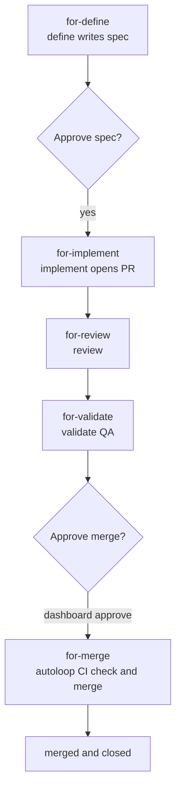

`gate1` is the human spec review (`defined`); `gate2` is the dashboard merge approval (`validated`). Both gates become automatic under `fritz.auto-pipeline`, but CI is still checked at `for-merge`.

### Dashboard approve path (validated to merge)

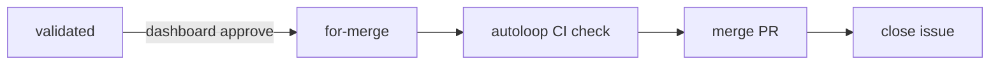

When a user clicks "Approve" on a `validated` issue in the Dashboard:
1. Issue transitions to `for-merge`
2. Autoloop checks CI status: green → merge, pending → retry next cycle, failed → `for-human`
3. Autoloop checks mergeability: mergeable → squash merge, conflicts → `for-human`
4. On success: merge PR, close issue, post comment, notify Telegram

### Auto-pipeline path (with `fritz.auto-pipeline` label)

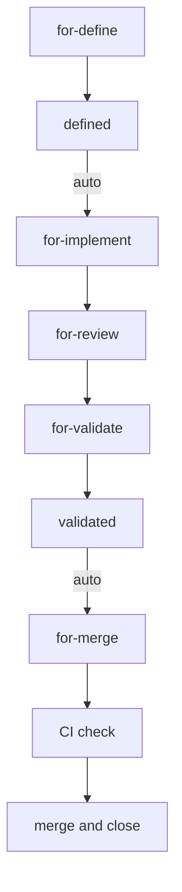

> [!IMPORTANT]
> `fritz.auto-pipeline` removes the two human gates only. CI is still checked at `for-merge` before merge; a repo with no CI configured effectively merges on trust.

When `fritz.auto-pipeline` is set on an issue, two manual **human** gates become automatic:
1. `defined` → `for-implement` (skips human spec review)
2. `validated` → `for-merge` (skips the human merge gate; the `for-merge` handler still runs CI checks before merging — see `handleAutoPipelineValidated()` in autoloop.ts)

Auto-pipeline does **not** skip CI: the issue still passes through `for-merge`, which checks CI and escalates to `for-human` on failure. A repo with no CI configured effectively merges on trust.

### Depends-On Support
Issues with `fritz.depends-on:NNN` labels are blocked until dependency issue #NNN is closed.
The autoloop checks dependencies before spawning any agent.

### Rework path (review/validate rejects)

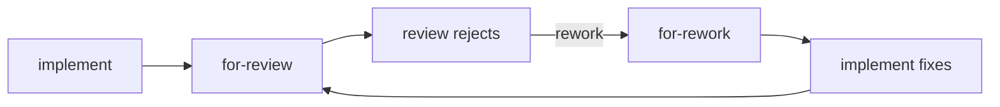

### Safety valve (max 3 rework cycles)

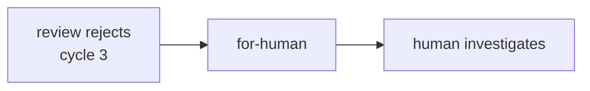

Rework is triggered when review or validate agents call `report.sh complete --outcome=rejected`.
Cycle count is tracked via `fritz.rework:N` labels on the GitHub issue.
When cycle count exceeds 3, the issue escalates to `for-human` with a Telegram notification.

### Status Labels

| Label | Purpose | Spawns Agent |
|-------|---------|--------------|
| `fritz.status:for-define` | Needs definition/spec work | define |
| `fritz.status:defined` | Spec complete, awaiting human review | none (human gate; auto-pipeline: auto-transitions to for-implement) |
| `fritz.status:for-implement` | Needs implementation | implement |
| `fritz.status:for-architect` | Needs architecture design | architect |
| `fritz.status:for-ux` | Needs UX design | ux |
| `fritz.status:for-budget` | Needs effort estimation | budget |
| `fritz.status:for-review` | Needs code review | review |
| `fritz.status:for-validate` | Needs validation/QA | validate |
| `fritz.status:for-security-review` | Needs security audit | security-review |
| `fritz.status:for-rework` | Needs fixes from review/validate | implement |
| `fritz.status:for-human` | Needs human attention | none |
| `fritz.status:active` | Agent currently working | — |
| `fritz.status:for-merge` | Dashboard-approved, autoloop handles merge | No (autoloop merges inline with CI checks) |
| `fritz.status:validated` | Validation passed | none (human merge via Dashboard; auto-pipeline: auto-advances to for-merge, where CI is still checked) |
| `fritz.status:accepted` | Human approved, ready to merge | — |

## Status Update Pattern

The GitHub issue serves as the **single source of truth** for tracking work item lifecycle. All agents post status updates to the linked issue:

| Agent | Posts To | Content |
|-------|----------|---------|
| define | Issue | Specs ready notification |
| implement | Issue | Progress updates, PR created |
| review | Issue + PR | Summary (verdict, blockers, warnings) on issue; detailed feedback on PR |
| security-review | Issue | Security audit report with severity-classified findings |
| validate | Issue | Validation results |

This ensures users can see the complete feature lifecycle in one place without checking multiple PRs or locations.

## Configuration

Configuration is split across three layers based on a guiding principle:

| Layer | What belongs here | Committed to git? |
|-------|------------------|-------------------|
| **`.env`** | Secrets (tokens, API keys), infrastructure identity (host paths, ports, URLs, repo names) | No |
| **`fritz.yaml`** | Operational tuning (timeouts, intervals, limits, feature toggles, agent settings) | Yes |
| **Code constants** | Internal invariants (buffer sizes, cache TTLs, protocol constants) | Yes (source) |

### `.env` — Secrets & Infrastructure Identity
```bash
# Authentication (optional for local dev with Claude Code installed)
ANTHROPIC_API_KEY=sk-ant-...

# Required
TELEGRAM_BOT_TOKEN=123:ABC...
TELEGRAM_CHAT_ID=-100...

# Optional but recommended
GH_TOKEN=ghp_...
GITHUB_REPO=owner/repo
```

### `fritz.yaml` — Operational Tuning
```yaml
defaults:
  ttl: 1800
  chatTtl: 14400
  model: claude-sonnet-4-6      # Sonnet default; implement/architect/security-review override to Opus
claude:
  claudeSkipPermissions: true
  claudePrintMode: true
daemon:
  watchdogIntervalSec: 60
  workspaceMaxAgeHours: 24
  logArchiveMaxAgeDays: 0            # 0 = indefinite retention
telegram:
  chatFeedbackEnabled: true
  editInPlaceEnabled: true
  editMinIntervalMs: 5000
  notificationMode: essential  # essential | quiet | compact | verbose
roles:
  implement:
    ttl: 1500
    model: claude-opus-4-8     # Override: complex coding stays on Opus
```

Operational configuration in `config/fritz.yaml`:
- Agent defaults (TTL, model) and per-role overrides
- Daemon operational limits
- Dashboard toggle (`dashboard.enabled`)
- Telegram topic thread IDs (`telegram.topics` section)

**Authentication:**
- **Recommended (Local & Production):** Install Claude Code on host machine, run `claude setup-token` once. Containers mount host's `~/.claude` directory for automatic subscription billing. No API key needed.
- **Fallback (CI/CD only):** Use `ANTHROPIC_API_KEY` environment variable for pay-per-token billing. Only use if Claude Code installation not possible.

## Multi-Repo Support

machina can orchestrate work on external repositories while keeping all issue tracking centralized.

### Label Syntax
```text
fritz.repo:owner/name           → Clone repo, use default branch
fritz.repo:owner/name:branch    → Clone repo, checkout specified branch
```

### Data Flow (External Repo)

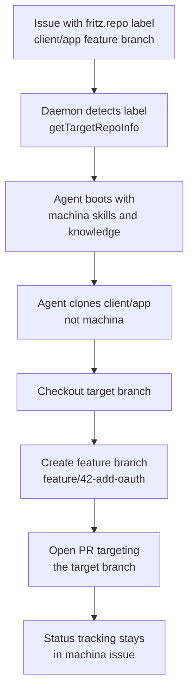

If the clone fails the boot aborts, the issue is set to `for-human`, and a warning comment is posted.

**Invalid repo/branch handling:** When a `fritz.repo:` label points to a non-existent repository or branch, the clone fails fast — the boot is aborted, the issue is set to `for-human`, and a warning comment with error details is posted. This prevents agents from running with an empty `./project/` directory. Clone failures for the default repo (`config.githubRepo`) remain non-fatal warnings to avoid blocking agents during transient network issues.

### Branch Targeting
```text
feature/1.8.0  ←────────────────── PR targets here
    │
    └── feature/42-add-oauth  ←── Agent works here
```

The assignment.md explicitly instructs the agent to use `gh pr create --base <branch>`.

### Key Functions
- `github.getTargetRepoInfo(issue)` — Parses `fritz.repo:` label, returns `{repo, branch?}`
- `autoloop.spawnAgent()` — Delegates to bootAgent() (no longer passes repo/branch directly)
- `boot.bootAgent()` — Performs label lookup if no explicit repo, clones repo, checkouts branch, generates branch-aware assignment

## Invocation Mode Handling

Sub-skill agents (architect, ux, budget) can be invoked in two modes:

### Standalone Mode (via `/boot`)

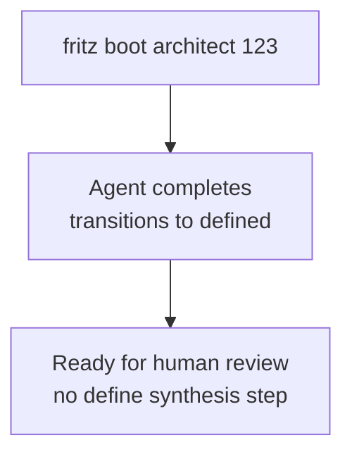

### Orchestrated Mode (via `/define`)

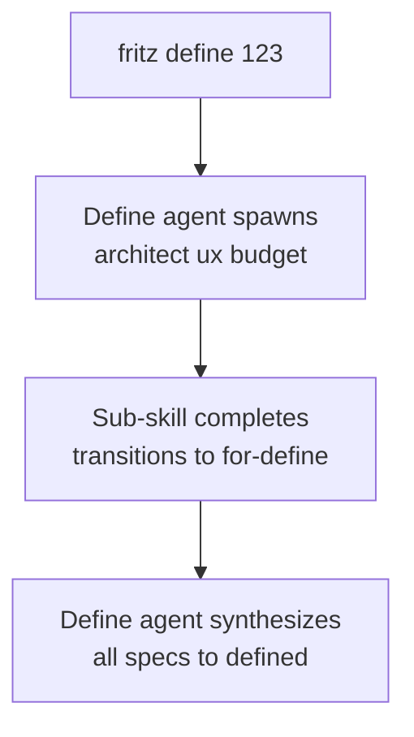

### Detection Mechanism

Mode is detected at boot time in `boot.ts`:
1. Check if `fritz.skill:define` label is present on the issue
2. If present → orchestrated mode (define agent is active)
3. If absent → standalone mode (direct invocation)

Mode is stored in the agent registry and used by `getNextStatus()` in `github.ts` to determine the correct status transition:
- Standalone: `architect` → `defined`
- Orchestrated: `architect` → `for-define`

Default behavior is 'orchestrated' for backwards compatibility.

## Diagnosis Data Flow

The `/diagnose` command runs entirely within the daemon process (no containers spawned):

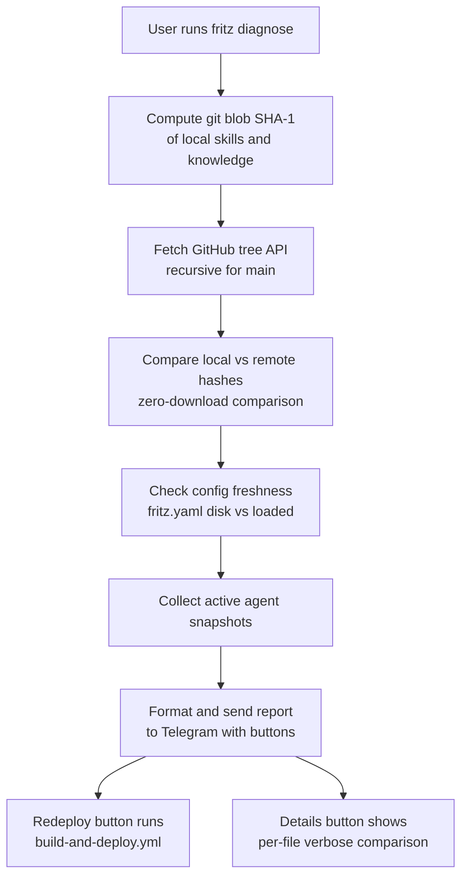

The `[Redeploy]` button triggers `gh workflow run build-and-deploy.yml` with a confirmation prompt.

Graceful degradation:
- No GH_TOKEN → local-only report with "cannot compare" message
- No GITHUB_REPO → local-only report
- GitHub API unreachable → local-only report (error status)

## Agent Communication (Persistent Interactive Sessions)

All agents use persistent interactive sessions for daemon-to-agent communication. `CLAUDE_CODE_EXPERIMENTAL_AGENT_TEAMS=1` is injected for all agents, enabling teammate spawning (controlled by skill file instructions). One-shot mode is retained only as an automatic fallback when a persistent session dies.

### Architecture

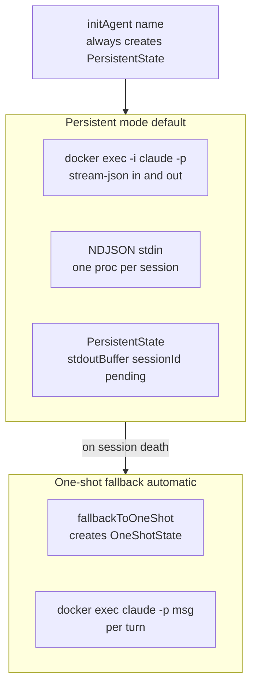

### How It Works

1. **Boot**: All agents get `CLAUDE_CODE_EXPERIMENTAL_AGENT_TEAMS=1` env var and use persistent mode
2. **Communication**: Daemon uses persistent interactive session (`docker exec -i claude -p --input-format stream-json --output-format stream-json`) with NDJSON messages on stdin
3. **Turn Detection**: `--output-format stream-json` produces JSON events; `type: "result"` signals turn completion; `session_id` is captured from early events for follow-up messages
4. **Fallback**: If persistent session dies, agent falls back to one-shot mode automatically via `fallbackToOneShot()`

### Key Files

- `fritz.yaml` → `teams:` section (TTL multiplier, teammate model — applied to all agents)
- `fritz-config.ts` → `TeamsConfig` interface, `getTeamsConfig()`
- `agent-comms.ts` → `initAgent(name)` defaults to persistent; one-shot kept for fallback
- `agents.ts` → Env var injection, TTL multiplier (applied to all agents)

### Constraints

- Teammates are in-process (same container slot)
- `--teammate-mode in-process` is the only viable option in Docker (no TTY)
- `ttlMultiplier` applies to all agents (operators can set to 1.0 to disable the multiplier effect)

## Retro Agent — Archive API Integration

The retro agent consumes the daemon's log archive API to perform log-driven analysis:

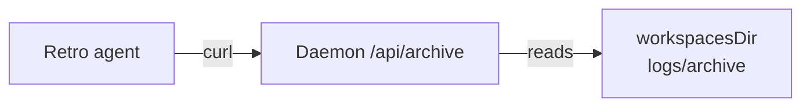

- **Endpoints consumed**: `GET /api/archive` (listing), `GET /api/archive/:name/summary`, `GET /api/archive/:name/log`
- **Authentication**: Uses `$FRITZ_API_TOKEN` (same per-agent token used for `/api/notify`)
- **Graceful degradation**: If archive API is unavailable, retro falls back to GitHub-only analysis
- **Output**: Separate PRs per change category (skills, knowledge, process) for independent review

## Dashboard

The dashboard provides visibility into agent activity, the autoloop pipeline, historical execution logs, and operational controls.

- **Local access**: `http://localhost:3456/dashboard` — no auth required (same port as agent API)
- **Remote access**: nginx reverse proxy (`nginx` Docker sidecar) via Tailscale edge router at `fritz.example.com` — TLS 1.3, LE wildcard cert
- **Real-time updates**: Server-Sent Events (SSE) push `agent-started`, `agent-update`, `agent-stopped`, `queue-update`, `issues-update`, `usage-update`, and `heartbeat` events. The `usage-update` and `heartbeat` `system` payloads include `usageAuthMode` and `usageMonitorRunning` fields
- **Data sources**: Registry (active agents), autoloop queue cache (upcoming work), log-archive (history), agents (live logs, start/stop), GitHub API (issues — 30s server-side cache), usage-monitor (subscription utilization)
- **Operational controls**: Kill active agents, boot agents from queue, toggle autoloop pause/resume, toggle usage override, manage issue labels (status, priority, dependencies) — all via POST endpoints with confirmation dialogs
- **Workflow view** (default tab): Pipeline Funnel showing issue counts per pipeline stage with visual indicators (human gates, active agents, escalations) + Attention Panel listing issues needing operator input grouped by urgency tier (escalated → awaiting approval → blocked → stale) with inline action buttons ([Approve], [Reject] with presets, [Boot], [Reassign], [View blockers]). Cross-links to Issues tab via stage click. "All Clear" empty state when nothing needs attention.
- **Agent cards**: Expandable with live log viewer (manual/auto-refresh), kill button, and issue trail visualization
- **Queue view**: Curated label badges (type, language, repo, auto-pipeline), blocker sub-rows with dependency resolution, boot/cancel/reassign buttons per issue
- **Issues view**: All open issues grouped by `fritz.status:*` pipeline status (or flat with sort), inline status/priority dropdowns, dependency management (`fritz.depends-on:*` labels), stale indicators (7+ days), text search, label filter chips. Label changes restricted to whitelist (`fritz.status:*`, `priority:p*`, `fritz.depends-on:*`).
- **History view**: Stop date, subagent count, issue trail in expanded view, paginated with role/issue filters
- **Usage view**: Subscription usage panel (auth mode badge, per-dimension utilization bars with color coding, reset times, monitor status, last check timestamp), historical token usage stats
- **Retro tab**: Displays retro scan metrics, role performance comparison, trends, and scan notes; data fetched from `/api/dashboard/retro` endpoint which fetches `fritz/knowledge/RETRO-METRICS.md` from GitHub Contents API (with local-filesystem fallback) using 120s SHA-based cache with single-flight request coalescing; lazy-loaded on tab activation
- **Status bar**: Autoloop toggle button (distinguishes manual vs usage-pause), subscription usage % with color coding, auth mode + last check in tooltip, override toggle, token usage display, connection status, uptime
- **API endpoints**: `workflow` (pipeline + attention data), `agent-log/:name` (live logs), `issue-trail/:issue` (agent history per issue), `agent/:name/stop`, `boot`, `autoloop/toggle`, `usage`, `subscription-usage` (real-time API utilization — includes `authMode`, `monitorRunning`), `subscription-usage/override` (toggle override), `issues` (list), `issues/:number/label` (label management), `issues/:number/comment` (post comment), `issues/:number` (detail), `retro` (parsed retro metrics), `retro/scans` (scan history only)
- **Feature gating**: `dashboard.enabled` in fritz.yaml (default `true`); remote access activated by setting `FRITZ_DOMAIN` in `.env`

## Usage Monitor

Tracks Anthropic subscription utilization and auto-pauses the autoloop when usage thresholds are exceeded.

- **usage-monitor.ts** — Queries Anthropic OAuth API (`/api/oauth/usage`), tracks 5-hour rolling window + 7-day quota + Opus-specific quota
- **Auth flow**: Env token → credentials file fallback on 403 → auto-refresh of expired tokens using Claude Code's OAuth client ID
- **Auto-pause**: When any dimension exceeds `pauseThreshold` (default 80%), creates `usage-paused` file; hysteresis via `resumeThreshold` (default 75%) prevents thrashing
- **P0 bypass**: Priority P0 issues spawn regardless of usage pause (but not manual pause)
- **Dashboard integration**: Real-time usage updates via SSE, override toggle
- **State files**: `usage-paused`, `usage-override` in `.workspaces/`
- **Configuration**: `usage` section in fritz.yaml (enabled, thresholds, check interval, P0 bypass)

## Feedback Manager

Provides real-time feedback during chat-mode agent interactions.

- **feedback-manager.ts** — Manages typing indicators, progress updates, and timeout warnings per agent session
- **Typing indicators**: Periodic "agent is typing" signals at `typingIndicatorIntervalMs` (default 4000ms, under Telegram's 5s expiry)
- **Progress updates**: Elapsed time + output preview at `progressUpdateIntervalMs` (default 30000ms)
- **Timeout warnings**: Alert when approaching `timeoutWarningThreshold` (default 0.8 of agent timeout)
- **Edit-in-place**: Updates existing status message instead of creating new ones; rate-limited by `editMinIntervalMs` (5000ms default)
- **Separate from notification mode**: Feedback manager handles chat session progress (`editInPlaceEnabled`); notification mode handles agent lifecycle events (`notificationMode: compact`) — they operate on different message streams

## Scheduler

Periodic task scheduler for automated issue creation.

- **scheduler.ts** — Creates GitHub issues on configurable schedules (hourly/daily/weekly) to trigger agent tasks (e.g., retro scans, security reviews)
- **State persistence**: `scheduler-state.json` in `.workspaces/` tracks last-run timestamps per job
- **Overdue detection**: Catches up on missed runs after daemon downtime
- **Dedup**: Checks if agent already running on same issue before creating
- **Configuration**: `scheduler:` section in fritz.yaml (disabled by default, configurable jobs with id, role, frequency, schedule)

## Event Log

Structured operational event log for daemon activities.

- **event-log.ts** — Append-only JSONL log at `.workspaces/logs/events.jsonl`
- **Event types**: `watchdog.cleanup` (workspace/archive deletions), `watchdog.orphan` (orphaned label corrections)
- **Retention**: Last 500 entries (hardcoded `MAX_ENTRIES`), trimmed on daemon startup
- **SSE integration**: Events pushed to dashboard via Server-Sent Events

## GitHub State Management (Phased Approach)

GitHub write operations follow a phased decoupling strategy:

### Phase 1 (Current): Batch Label Mutations
- Single `gh issue edit` call for remove+add label operations (batch instead of separate calls)
- `logActivity` removed — no longer writes activity comments to GitHub issues

### Phase 2 (Current): Write-Behind Queue
- All mutations route through `ghQueued()` → `github-write-queue.ts`
- Token-bucket rate limiting with label coalescing (multiple label changes batched into single API call)
- Agent containers use daemon API endpoints (`/api/github/issues/:number/comment`, `/api/github/issues/:number/labels`) instead of direct `gh` calls
- Dashboard gets real-time write queue stats via SSE

### Key Files
- `github/github-write-queue.ts` — Write queue, token bucket, circuit breaker
- `github/github.ts` — `ghQueued()` wrapper for all write operations

## Security

- Secrets in environment only
- Docker isolation for agents
- **Agent write API (unauthenticated)**: The `/api/github/issues/:number/{comment,labels}` endpoints have no auth — they rely on Docker network isolation (only containers on the internal `fritz` network can reach the daemon)
- Time-limited execution (wall-clock TTL from agent start)
- No persistent state in containers
- **Telegram chat ID middleware**: All bot messages are gated by `TELEGRAM_CHAT_ID` — DMs and foreign groups are silently dropped (issue #290)
- **Per-agent API tokens**: Each agent receives a unique `FRITZ_API_TOKEN` at boot, validated on `/api/notify`, `/api/ask`, and `/api/archive` endpoints (issue #290)
