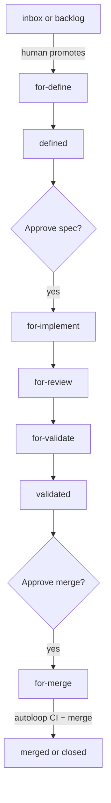
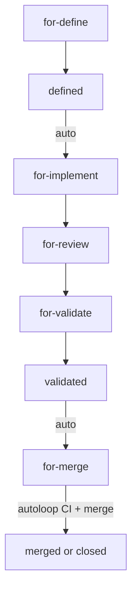
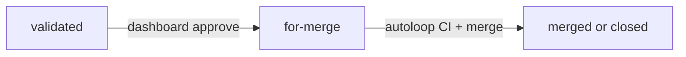
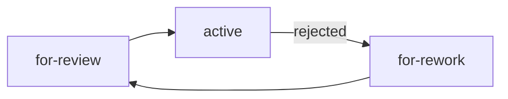

# Label System

How machina uses GitHub labels to control the autoloop daemon, track agent lifecycle, and manage issue workflow.

_Part of the machina [knowledge base](README.md) — read by every agent at boot._

## Label Categories

machina labels fall into three categories based on ownership and purpose:

| Category | Prefix | Managed By | Purpose |
|----------|--------|------------|---------|
| **System labels** | `fritz.*` | Daemon | Controls agent behavior and workflow |
| **Dependency labels** | `fritz.depends-on:` | Human / agent | Blocks agent spawn until dependency closes |
| **Project management labels** | No prefix | Human | Standard GitHub labels (priority, type) |

## Status Labels (`fritz.status:*`)

Status labels drive the **autoloop daemon** — they determine which agent (if any) gets spawned for an issue.

### Pre-Pipeline / Holding Statuses

These statuses exist in the label system but are **NOT polled by the autoloop**. Issues here sit idle until a human or machina (via conversation) advances them into an actionable stage.

| Label | Meaning | Spawns Agent? |
|-------|---------|---------------|
| `fritz.status:inbox` | Just landed — needs triage. No automation. | No |
| `fritz.status:backlog` | Triaged but intentionally parked — not ready to run yet. | No |

Advancing an issue from `inbox`/`backlog` into the active pipeline is done by the owner or machina conversationally: tell machina "bring the next fritzmonitor issues into the pipeline" and it promotes them, sets dependencies, and chains them in logical order (#616).

### Pipeline Statuses

| Label | Meaning | Spawns Agent? |
|-------|---------|---------------|
| `fritz.status:for-define` | Needs definition/spec work | Yes → `define` |
| `fritz.status:defined` | Spec complete, awaiting human review | No (human gate) |
| `fritz.status:for-architect` | Needs architecture design | Yes → `architect` |
| `fritz.status:for-ux` | Needs UX design | Yes → `ux` |
| `fritz.status:for-budget` | Needs effort estimation | Yes → `budget` |
| `fritz.status:for-implement` | Ready for implementation | Yes → `implement` |
| `fritz.status:for-review` | Needs code review | Yes → `review` |
| `fritz.status:for-validate` | Needs validation/QA | Yes → `validate` |
| `fritz.status:for-security-review` | Needs security audit | Yes → `security-review` |
| `fritz.status:for-pentest` | Needs penetration testing | Yes → `pentest` |
| `fritz.status:for-rework` | Needs fixes from review/validate feedback | Yes → `implement` |
| `fritz.status:for-merge` | Approved — autoloop merges PR with CI checks | No (autoloop merges inline) |
| `fritz.status:for-human` | Needs human attention (escalation) | No |
| `fritz.status:active` | Agent currently running | No (already running) |
| `fritz.status:validated` | Validation passed | No (human merge gate) |
| `fritz.status:accepted` | Human approved, ready to merge | No |

### Critical Distinction

| Label | Meaning |
|-------|---------|
| `fritz.status:for-implement` | This issue is WAITING for an implement agent to pick it up |
| `fritz.status:active` | An agent IS RUNNING on this issue right now |
| `fritz.skill:implement` | This issue is an implementation task (metadata only) |

`for-*` does NOT mean an agent is running. The autoloop checks `for-*` labels to decide what to spawn next. Once spawned, the daemon replaces `for-*` with `active`.

### Status Transitions

Statuses below are shown without the `fritz.status:` prefix. An agent runs as `active` between each stage; the two diamonds are the human approval gates.

**Normal flow:**



> [!NOTE]
> The dashboard "Queued" panel is NOT a label — it is a derived view of all issues with `for-*` status labels that do not currently have an active agent. "Queued" means ready and waiting for an agent slot. Once the autoloop spawns an agent, the issue leaves Queued and enters the active pipeline.

**Auto-pipeline flow** (with the `fritz.auto-pipeline` label — both human gates are skipped, CI still runs at `for-merge`):



**Dashboard approve flow** (operator clicks Approve in the dashboard):



**Rework flow** (review or validate rejects):



After 3 rework cycles (`fritz.rework:3`), the issue escalates to `for-human`.

## Skill Labels (`fritz.skill:*`)

Skill labels indicate **what type of work** the issue requires. They are metadata — they do not trigger agent spawns on their own.

| Label | Meaning |
|-------|---------|
| `fritz.skill:implement` | Implementation task |
| `fritz.skill:review` | Review task |
| `fritz.skill:validate` | Validation task |
| `fritz.skill:define` | Definition/spec task |
| `fritz.skill:architect` | Architecture design task |
| `fritz.skill:ux` | UX design task |
| `fritz.skill:budget` | Effort estimation task |
| `fritz.skill:pentest` | Penetration testing task |
| `fritz.skill:security-review` | Security audit task |

Skill labels also affect agent behavior. For example, sub-skills (architect, ux, budget) check for `fritz.skill:define` to determine if they are running in orchestrated mode (invoked by `/define`) or standalone mode (invoked directly).

## Behavioral Labels

These labels modify how agents or the daemon behave:

| Label | Effect |
|-------|--------|
| `fritz.auto-pipeline` | Skips the two human gates only — `defined`→`for-implement` and `validated`→`for-merge` become automatic. CI still runs at `for-merge` (see note below). |
| `fritz.long-running` | Sets agent TTL=0 (no expiration). Detected at boot time. Agent still stoppable via `/stop` |
| `fritz.manual` | Manual hold. Applied via `fritz hold #N`, removed via `fritz release #N`. Used for operator-controlled pauses on individual issues. **Known gap:** autoloop does NOT currently filter by this label — the label is applied for visibility (dashboard, queue display) but autoloop will still spawn agents for `fritz.manual` issues. Enforcement is planned. |
| `fritz.rework:N` | Tracks rework cycle count (N=1,2,3). Escalates to `for-human` after 3 cycles |

> [!IMPORTANT]
> `fritz.auto-pipeline` removes the two human approval gates only. The issue still passes through `for-merge`, which runs the CI check before merging — auto-pipeline does NOT skip CI. (A repo with no CI configured effectively merges on trust.)

## Repository Labels (`fritz.repo:*`)

Target a specific repository (and optionally branch) for the agent's work:

```text
fritz.repo:owner/name           → Clone repo, use default branch
fritz.repo:owner/name:branch    → Clone repo, checkout specified branch
```

**Example:** `fritz.repo:client/app:feature/1.8.0` clones `client/app` and checks out `feature/1.8.0`.

If the repo/branch doesn't exist, the boot fails fast — the issue is set to `for-human` with an error comment.

## Language Labels (`fritz.lang:*`)

Select which Docker image to use for the agent container:

| Label | Docker Image |
|-------|-------------|
| `fritz.lang:java` | `fritz-agent-java` (OpenJDK 21, Maven, Gradle) |
| `fritz.lang:cpp` | `fritz-agent-cpp` (gcc, cmake, ninja, gdb) |
| _(no label)_ | `fritz-agent` (Node.js 20, default) |

## Dependency Labels (`fritz.depends-on:*`)

Block agent spawn until the dependency issue is closed:

```text
fritz.depends-on:123    → Blocks until issue #123 is closed
fritz.depends-on:456    → Can have multiple dependencies
```

Even if an issue has `fritz.status:for-implement`, the autoloop will NOT spawn an agent if any `fritz.depends-on:` dependency is still open.

### Lifecycle
- **Applied by:** machina conversationally ("chain the fritzmonitor tickets"), operator manually, or via `fritz unblock #N` (removes all)
- **Auto-cleanup:** autoloop runs `cleanupStaleDependsOnLabels()` each cycle — when the referenced issue is closed, the `fritz.depends-on:N` label is removed from all open issues and deleted from the repo
- **Dashboard:** shows dependency badges with remove buttons; supports adding dependencies inline

## Project Management Labels

These are standard GitHub labels that machina reads but does not own:

| Label | Used By |
|-------|---------|
| `priority:p0` through `priority:p3` | Autoloop sorts spawn order (p0 first, p3 last). Unprioritized issues processed last |
| `type:feature`, `type:bug`, etc. | Informational — no daemon behavior |

## Examples

### New feature, full pipeline
```text
1. Human creates issue with: fritz.skill:implement, fritz.status:for-define
2. Autoloop spawns define agent → status becomes active
3. Define completes → status becomes defined
4. Human reviews spec → sets fritz.status:for-implement
5. Autoloop spawns implement agent → status becomes active
6. Implement creates PR → status becomes for-review
7. Review agent runs → status becomes for-validate
8. Validate agent runs → status becomes validated
9. Human merges PR and closes issue
```

### Auto-pipeline feature (no human gates)
```text
1. Human creates issue with: fritz.auto-pipeline, fritz.status:for-define
2. Same as above, but defined → for-implement is automatic
3. Same as above, but validated → for-merge is automatic (for-merge still runs CI, then merges + closes)
```

### External repo work
```text
1. Human creates issue with: fritz.repo:client/app:main, fritz.status:for-implement
2. Agent clones client/app (not machina), works on main branch
3. PR is created in client/app; status tracking stays in machina issue
```

### Blocked by dependency
```text
Issue #42: fritz.status:for-implement, fritz.depends-on:41
→ Autoloop skips #42 until #41 is closed
→ Once #41 closes, autoloop picks up #42 on next cycle
```

---
_See also: [ARCHITECTURE.md](ARCHITECTURE.md) (issue workflow, naming conventions), [SKILL-MODES.md](SKILL-MODES.md) (orchestrated vs standalone), [LANGUAGES.md](LANGUAGES.md) (language image selection)_
