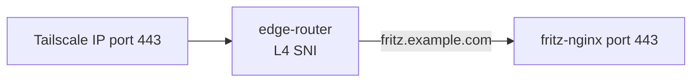

# machina Operations — Data Lifecycle & Retention

machina manages data across agent workspaces, log archives, registry state, Docker containers, and in-memory caches. Each has its own retention policy, cleanup trigger, and configuration. This guide is the single source of truth for all data lifecycle mechanisms.

_Part of the machina [knowledge base](README.md) — read by every agent at boot._

## Quick Reference

| Data | Location | Retention | Cleanup Trigger | Config |
|------|----------|-----------|-----------------|--------|
| Agent workspaces | `.workspaces/{name}/` | 24 hours (default) | Watchdog cycle | `daemon.workspaceMaxAgeHours` |
| Log archives | `.workspaces/logs/archive/{name}/` | Indefinite (default) | Watchdog cycle | `daemon.logArchiveMaxAgeDays` |
| Docker containers | Docker engine | Until exit + stop | Exit watcher / Watchdog | — |
| Registry state | `.workspaces/registry.json` | Runtime (in-memory) | Agent deregister | `daemon.persistDebounceMs` |
| Event log | `.workspaces/logs/events.jsonl` | Last 500 entries | Daemon startup | `MAX_ENTRIES` (hardcoded) |
| Daemon log | `.workspaces/logs/daemon.log` | 5 MB + 1 backup | Daemon startup | Hardcoded in `index.ts` |
| GitHub release cache | In-memory | 1 hour | Watchdog cycle | `RELEASE_CACHE_TTL_MS` (hardcoded) |
| Orphaned GitHub labels | GitHub API | Immediate fix | Watchdog cycle | — |
| Agent comms state | In-memory | Until agent stop | Agent exit | — |
| Usage monitor state | `.workspaces/usage-paused`, `usage-override` | Permanent (files) | Manual / usage-monitor | `usage` section in fritz.yaml |
| Scheduler state | `.workspaces/scheduler-state.json` | Permanent (file) | Scheduler | `scheduler` section in fritz.yaml |

## 1. Agent TTL & Expiration

> [!NOTE]
> TTL is wall-clock time measured from the agent's `started` timestamp and does NOT reset on activity or communication. Defaults: `1800s` (30m); chat mode `14400s` (4h base); `implement` role `1500s`.

### What
Agents have a time-to-live (TTL) that determines maximum execution duration. TTL is wall-clock time measured from the agent's `started` timestamp — it does NOT reset on communication or activity (`core/registry.ts` `getExpiredAgents()`).

### Configuration
- `defaults.ttl`: Global default (1800s = 30 minutes)
- `roles.{role}.ttl`: Per-role override (e.g., implement: 1500s = 25 minutes)
- `teams.ttlMultiplier`: Multiplier applied to all agent TTLs (default: 2.0)
- `fritz.long-running` label: Sets TTL=0 (disabled, never expires)

### How It Works
- Watchdog checks every `watchdogIntervalSec` (default: 60s)
- `registry.getExpiredAgents()` computes: `expires = new Date(started).getTime() + ttl * 1000`, then `now > expires`
- The baseline is the fixed `started` timestamp — communication/activity does NOT extend it. `lastActivityAt` is recorded for display only and does not affect TTL.
- Agents with `ttl === 0` are skipped (long-running)
- On expiry: `lifecycle.timeout()` → `agents.stopAgent(name, 'dead')`

> [!WARNING]
> At TTL expiry the agent is stopped immediately regardless of in-flight work — because TTL is wall-clock, an active agent is not spared. Use the `fritz.long-running` label (TTL=0) for work that must not be time-boxed.

TTL expiry is distinct from the watchdog's detection of dead/stale containers (`syncProcesses()`), which deregisters agents whose process has vanished regardless of TTL.

### Key Files
- `core/registry.ts` — `getExpiredAgents()`, `touchAgent()`
- `core/watchdog.ts` — expiry check loop
- `agents/fritz-config.ts` — `getRoleTtl()`, `getTeamsConfig()`

## 2. Workspace Cleanup

### What
Agent workspace directories are deleted after agents complete and a configurable age threshold is reached.

### Configuration
- `daemon.workspaceMaxAgeHours`: Hours before stopped agent workspaces are deleted (default: 24). Set to 0 to disable cleanup.

### Eligibility Criteria
1. NOT in local registry (agent already stopped/deregistered)
2. NOT the orchestrator workspace (`fritz/`)
3. NOT the `logs/` directory (separate retention policy)
4. Directory mtime older than `workspaceMaxAgeHours`

### How It Works
- Watchdog calls `cleanupWorkspaces()` every cycle
- Lists directories in `.workspaces/`
- Filters by eligibility criteria above
- Recursively deletes matching directories

### Key Files
- `agents/agents.ts` — `cleanupWorkspaces()`
- `core/watchdog.ts` — triggers cleanup each cycle

## 3. Log Archive Retention

### What
When agents exit, their execution logs are archived to a persistent location that survives workspace cleanup. Archives have their own retention policy.

### What's Archived
- `agent.log` — Full execution log
- `summary.json` — Metadata: duration, token usage, tool stats, model, exit status, timestamps, subagent count

### Archive Location
`.workspaces/logs/archive/{agent-name}/`

### Configuration
- `daemon.logArchiveMaxAgeDays`: Days before archives are deleted. Code default: 7 days. Production config: 0 (indefinite retention — archives never deleted).
- Set to a positive number to enable cleanup.

### How It Works
- On agent exit: `log-archive.ts` copies `agent.log` and writes `summary.json` to the archive directory (async, non-blocking)
- Watchdog calls `cleanupLogArchive()` every cycle
- Uses `summary.json` "ended" timestamp (not filesystem mtime) for age calculation
- Guard: `if (maxAgeDays <= 0) return 0;` — 0 means disabled

### Disk Usage
- ~150KB average per agent
- ~30MB/week at ~200 agents/week
- ~1.4GB/year — practical for indefinite retention

### Key Files
- `agents/log-archive.ts` — archival + cleanup + API
- `core/watchdog.ts` — triggers cleanup each cycle

## 4. Docker Container Cleanup

### What
Docker containers are removed after agent exit or on daemon startup.

### Trigger Points

**On agent exit (exit watcher):**
1. Parse session for stats (tokens, tools, duration)
2. Archive logs
3. Update GitHub labels
4. Destroy agent communication state
5. Stop & remove Docker container (`docker stop` + `docker rm`)
6. Deregister from local registry

**On daemon startup (orphan cleanup):**
- `cleanupOrphanAgents()` lists all running containers with `fritz-agent-` prefix
- Stops and removes all orphans
- Clears local registry

### Key Files
- `agents/agents.ts` — `stopAgentDocker()`, `cleanupOrphanAgents()`

## 5. Registry State Management

### What
In-memory cache of all agent state, persisted to disk via debounced writes.

### Location
`.workspaces/registry.json`

### Lifecycle
1. `init()` — Called at daemon startup, loads from disk
2. Runtime — All reads/writes go through in-memory cache
3. Write debounce — File persistence every `persistDebounceMs` (default: 1000ms)
4. `flush()` — Called on graceful shutdown, forces immediate write

### Cleanup
- `deregisterAgent(name)` removes entry from in-memory cache
- Change propagates to disk via debounced write
- On crash: up to 1s of changes may be lost (reconstructable from Docker state)

### Key Files
- `core/registry.ts` — `init()`, `flush()`, `deregisterAgent()`

## 6. Event Log

### What
Structured event log for daemon operational events (watchdog cleanups, orphan label fixes).

### Location
`.workspaces/logs/events.jsonl` (append-only JSONL)

### Retention
- Max entries: 500 (hardcoded `MAX_ENTRIES` in `event-log.ts`)
- Trimmed on daemon startup via `trimOnStartup()`
- Keeps last 500 entries, removes older ones

### Key Files
- `core/event-log.ts` — `logEvent()`, `trimOnStartup()`

## 7. Daemon Log Rotation

### What
The daemon's own stdout/stderr log file.

### Location
`.workspaces/logs/daemon.log`

### Retention
- Max size: 5 MB (hardcoded in `index.ts`)
- On startup: if file exceeds limit, rotated to `daemon.log.old` (overwrites previous backup — only 1 generation kept)

### Key Files
- `index.ts` — `setupDaemonLog()`, log rotation logic at startup

## 8. GitHub Release Cache

### What
In-memory deduplication cache preventing duplicate "Agent Finished" comments on GitHub issues.

### Retention
- TTL: 1 hour (hardcoded `RELEASE_CACHE_TTL_MS` in `github.ts`)
- Pruned by watchdog every cycle via `pruneReleasedAgents()`

### Key Files
- `github/github.ts` — `pruneReleasedAgents()`, `releasedAgents` Map

## 9. Orphaned GitHub Label Cleanup

### What
Detects agents that are marked as `active` on GitHub but no longer exist in the local registry (crash window between deregister and label update).

### Trigger
- Watchdog checks every cycle via `cleanupOrphanedLabels()`
- Compares GitHub `fritz.status:active` issues against local registry
- Skips check if a boot is in progress (`agents.isBootInProgress()`) to avoid false positives
- Transitions orphaned labels from `active` → `for-human`
- Emits `watchdog.orphan` event to the event log

### Key Files
- `core/watchdog.ts` — orphan detection logic
- `github/github.ts` — label transition

## 10. Agent Communication State

### What
In-memory state for persistent interactive sessions between daemon and agents.

### What's Cleaned
- Drain timer (message queue processing)
- Pending response promises (rejected with "agent was stopped")
- Active process (killed with SIGTERM)
- Queued messages (rejected)
- Workspace path cache

### Trigger
- Called via `destroyAgent(name)` when agent is deregistered or stopped

### Key Files
- `agents/agent-comms.ts` — `destroyAgent()`

## 11. Usage Monitor State

### What
File-based state for the usage monitor's autoloop pause mechanism.

> [!WARNING]
> When Claude subscription usage is high, the usage-monitor writes `.workspaces/usage-paused` and the autoloop stops spawning new agents until hysteresis allows resume. In-flight agents keep running; only new spawns pause.

### Files
- `.workspaces/usage-paused` — Created when usage exceeds threshold, removed when hysteresis allows resume
- `.workspaces/usage-override` — Created when operator toggles override via dashboard

### Retention
- Files persist across daemon restarts (intentional)
- `usage-paused` is managed automatically by usage-monitor
- `usage-override` is managed by operator via dashboard toggle

### Key Files
- `agents/usage-monitor.ts` — pause/resume/override logic
- `agents/autoloop.ts` — `isPaused()` checks both manual and usage-pause

---

## Pipeline Management

### Telegram Commands
- `fritz queue` — show current pipeline with fritz.depends-on chains and priority badges
- `fritz express #N` — add `priority:p0` to issue N (highest spawn priority)
- `fritz hold #N` — add `fritz.manual` label (see known gap below)
- `fritz release #N` — remove `fritz.manual`
- `fritz unblock #N` — remove all `fritz.depends-on:*` labels from issue N

### Conversational Planning
Tell machina in natural language:
- "Chain the fritzmonitor tickets" → machina reads issues, infers order, applies fritz.depends-on labels
- "Move #617 to the front, client is blocked" → adds priority:p0
- "Hold everything on fritzmonitor until #611 is done" → applies fritz.depends-on + fritz.manual

### Label-Based Overrides (GitHub UI)
- `priority:p0` — highest spawn priority
- `fritz.manual` — manual hold. Applied by `fritz hold` / removed by `fritz release`. **Known gap:** autoloop does NOT currently filter by this label — the label is applied to the issue for visibility and dashboard display, but autoloop will still spawn agents for issues with `fritz.manual`. Enforcement is planned but not yet implemented.
- `fritz.depends-on:N` — blocks until issue N is closed

### API Endpoints

**Daemon API** (port 3456, internal):
- `GET /api/pipeline/queue` — current pipeline with labels and fritz.depends-on chains
- `POST /api/pipeline/express` — `{ issue: N }` → adds priority:p0
- `POST /api/pipeline/hold` — `{ issue: N }` → adds fritz.manual
- `POST /api/pipeline/release` — `{ issue: N }` → removes fritz.manual
- `POST /api/orchestrator/message` — `{ message, commandHint?, timeoutMs? }` → conversational relay to machina orchestrator
- `POST /api/notify` — agent → daemon notification
- `POST /api/ask` — agent → daemon question (blocks for answer)
- `GET /api/archive` — list archived agent sessions

**fritzbridge API** (port 9876, optional bridge to an external agent system):
- `POST /fritz/converse` — talk to machina orchestrator (primary external agent → machina channel)
- `POST /fritz/tell` — message to a specific agent
- `POST /fritz/boot` / `POST /fritz/stop` — agent lifecycle
- `POST /fritz/submit` — create GitHub issue
- `GET /fritz/queue` — pipeline state
- `POST /fritz/issue/:n/express|hold|release|fritz.depends-on` — pipeline mutations
- `GET /fritz/status|agents|archive|events` — observability

---

## Watchdog Cycle Summary

Every `watchdogIntervalSec` (default: 60s), the watchdog runs:

1. **Check expired agents** — TTL exceeded → stop & archive
2. **Sync processes** — Detect dead containers → deregister, archive logs
3. **Cleanup orphaned labels** — GitHub `active` without local agent → `for-human`
4. **Cleanup old workspaces** — Stopped agents older than threshold → delete
5. **Cleanup old archives** — Archives older than threshold → delete (if enabled)
6. **Prune release cache** — Expired dedup entries → remove

## Daemon Startup Cleanup

On every daemon start:

1. **Cleanup orphan containers** — Running `fritz-agent-*` containers → stop & remove
2. **Trim event log** — Keep last 500 entries
3. **Rotate daemon log** — If > 5 MB, rotate to `.old`

## Configuration Reference

All retention-related settings in `config/fritz.yaml`:

```yaml
defaults:
  ttl: 1800                          # Default agent TTL in seconds (30m base)
  chatTtl: 14400                     # Chat-mode TTL base (4h), used for -chat agents

daemon:
  watchdogIntervalSec: 60            # Cleanup check frequency
  workspaceMaxAgeHours: 24           # Workspace deletion threshold (0 = disabled)
  logArchiveMaxAgeDays: 0            # Archive deletion threshold (0 = indefinite)
  persistDebounceMs: 1000            # Registry write debounce

teams:
  ttlMultiplier: 2.0                 # Applied to all agent TTLs

roles:
  implement:
    ttl: 1500                        # 25m base for implement agents
  architect:
    ttl: 3600                        # 1h base for architect agents
  review:
    ttl: 900                         # 15m base for review agents
  validate:
    ttl: 900                         # 15m base for validate agents
  define:
    ttl: 1200                        # 20m base for define agents
  pentest:
    ttl: 3600                        # 1h base for pentest agents
  # Effective TTL = ttl × teams.ttlMultiplier. Roles without a ttl override
  # (e.g. ux, security-review, budget) inherit defaults.ttl.
  # ... see fritz.yaml for all role-specific TTLs
```

Hardcoded constants (not configurable):
- Event log max entries: 500 (`core/event-log.ts`)
- Daemon log max size: 5 MB (`index.ts`)
- GitHub release cache TTL: 1 hour (`github/github.ts`)
- Agent comms message timeout: 180s (configurable via `daemon.agentMessageTimeoutMs`)

## GitHub API Rate Limits & Write Queue

### Token Bucket Rate Limiter
All GitHub write operations route through `ghQueued()` → `github-write-queue.ts` with a token bucket rate limiter:
- **Sustained rate**: ≤30 writes/min
- **Burst**: 10 (allows short spikes above sustained rate)
- **Priority levels**: critical (bypass queue), high (label mutations), normal (comments), low (best-effort)

### Write Queue Monitoring
- Dashboard shows queue depth, writes/min, and circuit breaker status in real-time via SSE
- Circuit breaker backoff tiers: 60s → 120s → 300s, resets after 1 hour clean

### Capacity Projections
- At N=20 agents, estimated ~200 writes/hr (well under GitHub's secondary rate limits)
- GitHub's secondary rate limit (~10-15 writes/min) is NOT tracked by `x-ratelimit-remaining`

### Agent GitHub Write API
Agent containers proxy GitHub writes through the daemon instead of calling `gh` directly:
- `POST /api/github/issues/:number/comment` — post an issue comment (body: `{ body: string }`)
- `POST /api/github/issues/:number/labels` — add/remove labels (body: `{ add?: string[], remove?: string[] }`)

> [!IMPORTANT]
> These endpoints are unauthenticated — security relies on Docker network isolation (only agent containers on the internal `fritz` network can reach the daemon). See [ARCHITECTURE.md](ARCHITECTURE.md) § Security.

### Configuration
- Write queue is enabled by default
- Can be disabled via feature flag for debugging
- Token bucket config: max queue depth 20/50/40/20 (critical/high/normal/low priority)

---


## Server Infrastructure (your-server)

### Access Model

All services are behind Tailscale — no public ports except SSH. Access requires Tailscale network membership.

| URL | Service |
|-----|---------|
| `https://fritz.example.com/dashboard` | machina Dashboard |
| `https://fritz.example.com/system-map` | System Map |

### Edge Router

A lightweight L4 SNI proxy (`edge-router`) listens on the Tailscale IP (`100.x.x.x:443`) and routes TLS connections by hostname to the correct backend nginx. No TLS termination — it reads the SNI field and forwards raw TCP.



- Project: `/home/youruser/Projects/edge-router/`
- Config: `stream.conf` (~10 lines, stateless, no certs)
- Networks: `fritz` (to reach the nginx container)

### TLS

A single Let's Encrypt wildcard certificate (`*.example.com`) covers all services:
- Issued via `certbot-dns-route53` (DNS-01 challenge against Route 53)
- Auto-renewed by certbot timer
- Renewal hook at `/etc/letsencrypt/renewal-hooks/deploy/reload-nginx.sh` reloads the nginx container
- Path: `/etc/letsencrypt/live/example.com/`

### Firewall (UFW)

```text
Default: deny incoming, allow outgoing
Rules:
  - 22/tcp (SSH)
  - tailscale0 interface (all Tailscale traffic)
```

### DNS (Route 53)

| Record | Value | Purpose |
|--------|-------|---------|
| `fritz.example.com` | `100.x.x.x` | Tailscale IP — only routable from tailnet |

### Monitoring Crons (root crontab)

| Schedule | Script | Purpose |
|----------|--------|---------|
| `*/5 * * * *` | `fritz-exporter.sh` | machina platform metrics → `fritz.prom` |
| `* * * * *` | `agent-lifecycle.sh` | Agent lifecycle metrics → `agent-lifecycle.prom` |

All scripts write to `/tmp/heartbeat-metrics/` for node-exporter's textfile collector.

### SSH Hardening

```text
PasswordAuthentication no
PermitRootLogin no
MaxAuthTries 3
X11Forwarding no
```

---

_See also: [ARCHITECTURE.md](ARCHITECTURE.md) for component design, [GOTCHAS.md](GOTCHAS.md) for operational quirks._

_Last updated: 2026-04-02_
